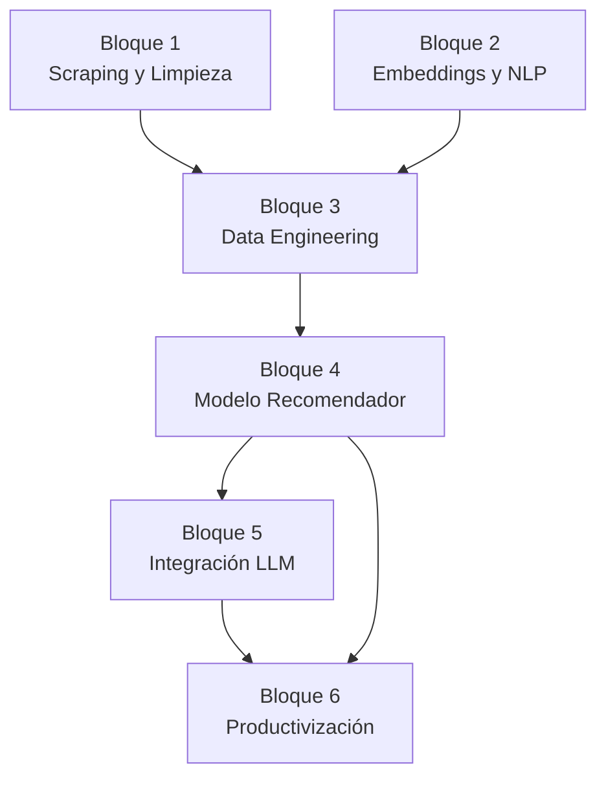
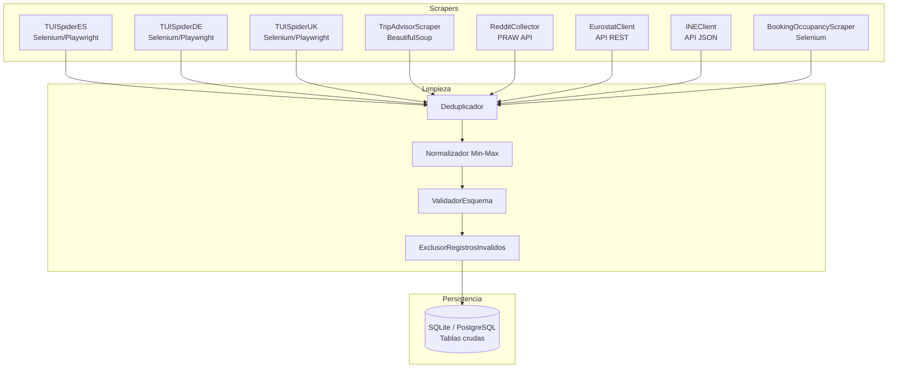
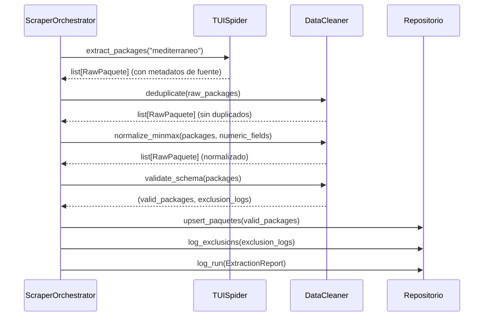
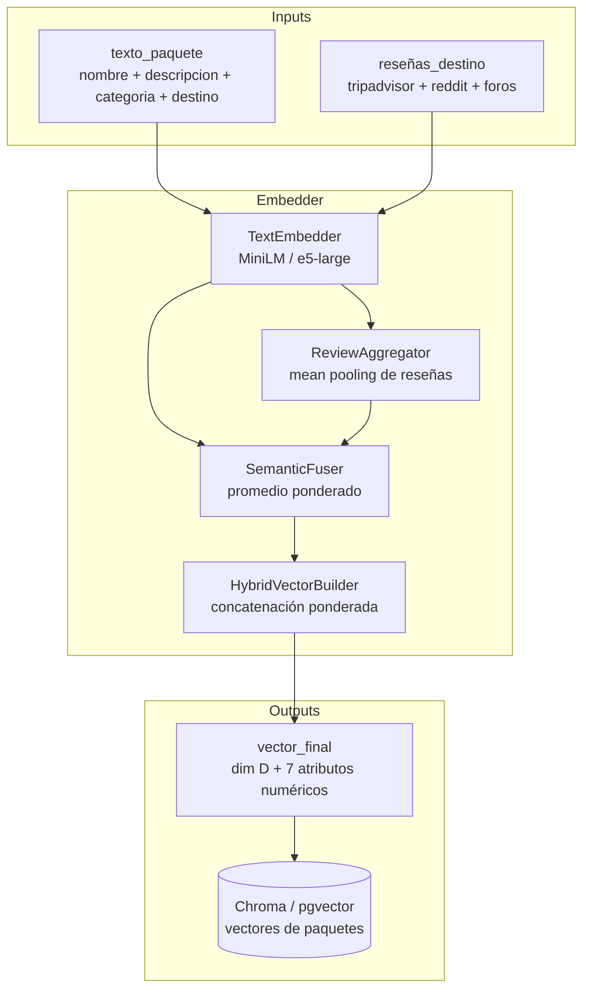
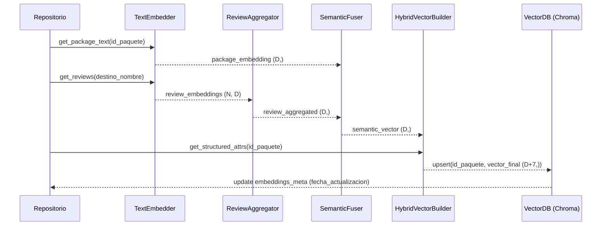
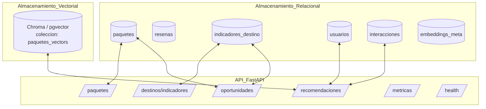
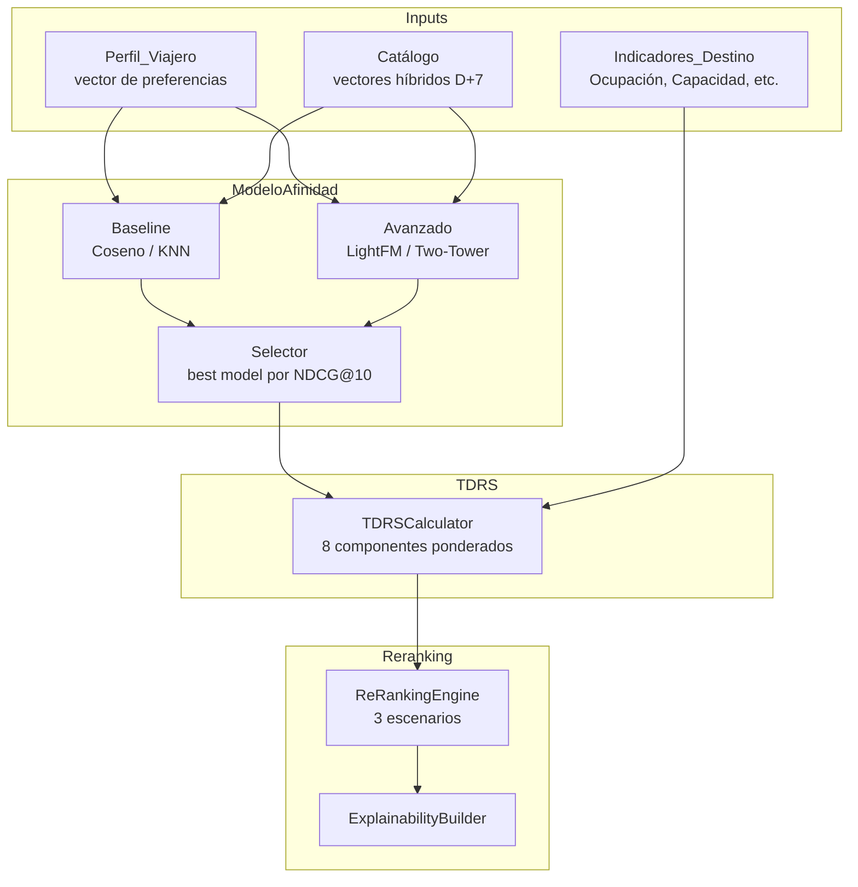

# Documento de Diseño Técnico — Motor de Recomendación TUI

## Visión General del Sistema

El sistema se articula en **seis bloques de pipeline** que transforman datos crudos de la web de TUI y fuentes públicas en recomendaciones personalizadas explicadas en lenguaje natural. La arquitectura sigue un flujo secuencial con dependencias explícitas entre bloques, aunque los bloques 1-3 pueden ejecutarse en paralelo durante el refresco periódico de datos.



**Stack tecnológico fijado (DECISIÓN-009 a 011):**
- Lenguaje: Python 3.11+
- BD relacional: SQLite (prototipo) → PostgreSQL (escalado)
- BD vectorial: Chroma (prototipo) → pgvector (escalado)
- ORM: SQLAlchemy
- API: FastAPI + Pydantic
- Embeddings: `paraphrase-multilingual-MiniLM-L12-v2` o `multilingual-e5-large` (pendiente DECISIÓN-006b)
- Interfaces: Streamlit (prototipo)

---


---

## Bloque 1 — Scraping y Limpieza de Datos

### Descripción

El Bloque 1 es la capa de ingestión de datos del sistema. Extrae información de paquetes turísticos de TUI (tres mercados: ES, DE, UK), reseñas de TripAdvisor y Reddit, indicadores estadísticos de Eurostat/INE/UNWTO, y datos de ocupación de Booking.com. Los datos crudos se limpian y normalizan antes de persistirlos en el Repositorio.

### Arquitectura del Bloque 1



### Componentes e Interfaces

#### ScraperOrchestrator

Coordina la ejecución de todos los scrapers según el calendario de refresco configurado. Gestiona reintentos y errores.

```python
class ScraperOrchestrator:
    def run_cycle(self, sources: list[str]) -> ExtractionReport
    def schedule(self, cron_expr: str) -> None
    def get_last_run_status(self) -> dict[str, RunStatus]
```

#### TUISpider (base común para los tres mercados)

```python
class TUISpider:
    market: str  # "es" | "de" | "uk"
    base_url: str

    def extract_packages(self, region: str) -> list[RawPaquete]
    def extract_package_detail(self, url: str) -> RawPaquete
    def handle_http_error(self, url: str, status_code: int) -> None
```

**Método de acceso:** Selenium/Playwright para renderizado JS. Política de reintentos: 3 intentos con backoff exponencial (1s, 2s, 4s). Respeta `robots.txt`.


#### RedditCollector

```python
class RedditCollector:
    subreddits: list[str]  # r/travel, r/solotravel, r/backpacking, r/Flights, r/TravelHacks, r/vacation

    def collect_posts(self, destination: str, limit: int = 100) -> list[RawResena]
    def collect_comments(self, post_id: str) -> list[RawResena]
```

**Acceso:** API oficial PRAW. Límite: 100 req/min. Credenciales via variables de entorno.

#### StatisticsClient (Eurostat / INE / UNWTO)

```python
class StatisticsClient:
    source: str  # "eurostat" | "ine" | "unwto"

    def fetch_occupancy(self, destination: str, year: int, month: int) -> IndicadorDestino
    def fetch_arrivals(self, country: str, year: int) -> IndicadorDestino
```

#### DataCleaner (Limpiador)

```python
class DataCleaner:
    def deduplicate(self, records: list[RawPaquete]) -> list[RawPaquete]
    def normalize_minmax(self, df: pd.DataFrame, columns: list[str]) -> pd.DataFrame
    def validate_schema(self, record: RawPaquete) -> ValidationResult
    def exclude_invalid(self, records: list[RawPaquete], threshold: float = 0.30) -> tuple[list[RawPaquete], list[ExclusionLog]]
```

**Regla de exclusión (RF-1.8):** Si un registro tiene más del 30% de sus atributos obligatorios vacíos tras la limpieza, se marca como inválido y se excluye del entrenamiento, registrando el motivo.

**Regla de deduplicación (RF-1.6):** Clave de unicidad = `(destino_nombre, nombre_hotel, fecha_salida, fecha_vuelta, ciudad_salida)`. En caso de duplicado, se conserva el registro con `fecha_extraccion` más reciente.

### Modelos de Datos (Tablas SQLite/PostgreSQL)

#### Tabla `paquetes`

Corresponde íntegramente al esquema ENTIDAD PAQUETE definido en DECISIÓN-005. Campos clave para el pipeline:

| Campo clave | Tipo | Uso en pipeline |
|-------------|------|----------------|
| `id_paquete` | VARCHAR(36) PK | Clave de referencia en embeddings e interacciones |
| `descripcion_texto` | TEXT | Input principal para embeddings NLP |
| `nivel_ocupacion` | FLOAT [0,1] | Input para TDRS y vector de features |
| `precio_base_eur` | FLOAT | Feature normalizada para vector híbrido |
| `temporada` | VARCHAR(10) | Calculado: Alta/Media/Baja según fechas |
| `embedding_id` | VARCHAR(36) FK | Referencia al vector en Chroma/pgvector |

#### Tabla `resenas`

Esquema completo según DECISIÓN-005. Campo crítico: `texto_original` (input para embedding de reputación).

#### Tabla `indicadores_destino`

Esquema completo según DECISIÓN-005. Campo crítico: `nivel_ocupacion` calculado a partir de `pernoctaciones_anuales` y capacidad máxima del destino.

### Flujo de Datos del Bloque 1



### Cálculo de Temporada

```python
def calcular_temporada(fecha_salida: date) -> str:
    """
    Alta:  junio, julio, agosto, diciembre
    Baja:  enero, febrero, marzo, noviembre
    Media: abril, mayo, septiembre, octubre
    """
    mes = fecha_salida.month
    if mes in [6, 7, 8, 12]:
        return "Alta"
    elif mes in [1, 2, 3, 11]:
        return "Baja"
    else:
        return "Media"
```

### Propiedades de Corrección (PBT relevantes)

- **PBT-7:** Para cualquier registro con `nivel_ocupacion > 1` o `precio_base_eur < 0`, el `DataCleaner` lanza `ValidationError` tipada.
- **RF-1.7:** Tras la normalización min-max, todos los campos numéricos del conjunto procesado están en [0, 1].

---


## Bloque 2 — Embeddings y NLP

### Descripción

El Bloque 2 transforma las representaciones textuales de paquetes y reseñas en vectores semánticos de dimensión fija, y los fusiona con atributos estructurados normalizados para producir el vector híbrido final de cada paquete. Este vector es el que ingresa al modelo recomendador.

### Arquitectura del Bloque 2



### Componentes e Interfaces

#### TextEmbedder

```python
class TextEmbedder:
    model_name: str       # configurado en config.yml
    model_version: str    # documentado para reproducibilidad (NF-3.2)
    embedding_dim: int    # 384 (MiniLM) o 1024 (e5-large)

    def embed_text(self, text: str) -> np.ndarray  # shape: (D,)
    def embed_batch(self, texts: list[str], batch_size: int = 64) -> np.ndarray  # shape: (N, D)
```

**Modelo candidato 1:** `paraphrase-multilingual-MiniLM-L12-v2` — 384 dimensiones, 50+ idiomas, ~500 MB RAM.
**Modelo candidato 2:** `multilingual-e5-large` — 1024 dimensiones, 100+ idiomas, ~2.5 GB RAM.
La selección final se documenta en DECISIÓN-006b tras el experimento de comparación de clusters.

#### ReviewAggregator

```python
class ReviewAggregator:
    def aggregate(self, review_embeddings: np.ndarray) -> np.ndarray:
        """Mean pooling de todos los embeddings de reseñas de un destino."""
        return np.mean(review_embeddings, axis=0)  # shape: (D,)
```

#### SemanticFuser

```python
class SemanticFuser:
    package_weight: float = 0.6   # peso del embedding del paquete
    review_weight: float  = 0.4   # peso del embedding de reputación

    def fuse(self, package_emb: np.ndarray, review_emb: np.ndarray) -> np.ndarray:
        """Promedio ponderado de embedding de paquete y embedding de reseñas."""
        return self.package_weight * package_emb + self.review_weight * review_emb
```

Los pesos son hiperparámetros configurables en `config.yml` (DECISIÓN-008).


#### HybridVectorBuilder

Implementa la fusión ponderada definida en DECISIÓN-008:

```python
class HybridVectorBuilder:
    weights: dict[str, float]  # w1..w7 configurables en config.yml

    # Pesos por defecto (DECISIÓN-008):
    # precio_base_eur      -> w1 = 1.0
    # duracion_dias        -> w2 = 0.5
    # nivel_ocupacion      -> w3 = 1.5  (mayor peso — clave para TDRS)
    # accesibilidad_destino -> w4 = 0.8
    # estrellas_hotel      -> w5 = 0.7
    # num_valoraciones_hotel -> w6 = 0.6
    # indicador_sostenibilidad -> w7 = 1.0

    def build(self, semantic_vector: np.ndarray, structured_attrs: dict[str, float]) -> np.ndarray:
        """
        Retorna vector_final = [semantic_vector | w1*precio | w2*duracion | ... | w7*sostenibilidad]
        Dimensión: D + 7
        """
        numeric_part = np.array([
            self.weights['w1'] * structured_attrs['precio_base_eur_norm'],
            self.weights['w2'] * structured_attrs['duracion_dias_norm'],
            self.weights['w3'] * structured_attrs['nivel_ocupacion'],
            self.weights['w4'] * structured_attrs['accesibilidad_destino_norm'],
            self.weights['w5'] * structured_attrs['estrellas_hotel_norm'],
            self.weights['w6'] * structured_attrs['num_valoraciones_hotel_norm'],
            self.weights['w7'] * float(structured_attrs['indicador_sostenibilidad_tui']),
        ])
        return np.concatenate([semantic_vector, numeric_part])
```

### Flujo de Generación de Embeddings



### Gestión Multilingüe

Los tres mercados de TUI producen textos en español, alemán e inglés. Ambos modelos candidatos son multilingües y no requieren traducción previa. El campo `idioma` de la entidad RESEÑA (detectado automáticamente con `langdetect`) permite filtrar reseñas por idioma si fuera necesario para análisis específicos.

### Propiedades de Corrección (PBT relevantes)

- **PBT-5 (round-trip):** `deserializar(serializar(vector_final)) == vector_final` — verificado para embeddings NumPy serializados como JSON y como ficheros `.npy`.
- **RF-3.3:** La dimensión del vector de salida es constante independientemente de la longitud del texto de entrada.
- **RF-3.6:** Para paquetes semánticamente equivalentes (mismo destino, categoría, temporada), la similitud coseno entre sus embeddings debe ser > 0,85.

---


## Bloque 3 — Data Engineering

### Descripción

El Bloque 3 centraliza el almacenamiento estructurado y vectorial, la capa de acceso a datos vía FastAPI y la gestión de interacciones (reales y sintéticas). Es la columna vertebral que conecta el pipeline de ingestión con el modelo recomendador.

### Arquitectura del Bloque 3



### Esquema de Base de Datos

#### Tabla `usuarios`

```sql
CREATE TABLE usuarios (
    id_usuario      VARCHAR(36) PRIMARY KEY,
    es_sintetico    BOOLEAN NOT NULL DEFAULT TRUE,
    -- Preferencias temáticas [0,1] — suma = 1.0 ± 0.01
    pref_cultura    FLOAT NOT NULL,
    pref_gastronomia FLOAT NOT NULL,
    pref_naturaleza FLOAT NOT NULL,
    pref_playa      FLOAT NOT NULL,
    pref_bienestar  FLOAT NOT NULL,
    pref_aventura   FLOAT NOT NULL,
    -- Restricciones
    presupuesto_min_eur  FLOAT NOT NULL,
    presupuesto_max_eur  FLOAT NOT NULL,
    duracion_min_dias    INT NOT NULL,
    duracion_max_dias    INT NOT NULL,
    temporada_preferida  VARCHAR(10),   -- Alta / Media / Baja
    requiere_accesibilidad BOOLEAN NOT NULL DEFAULT FALSE,
    distancia_max_km     FLOAT,
    interes_sostenibilidad FLOAT NOT NULL,  -- [0,1]
    -- Metadatos
    fecha_creacion  TIMESTAMP NOT NULL DEFAULT CURRENT_TIMESTAMP,
    seed_generacion INT       -- semilla usada si es sintético
);
```

#### Tabla `interacciones`

```sql
CREATE TABLE interacciones (
    id_interaccion  VARCHAR(36) PRIMARY KEY,
    id_usuario      VARCHAR(36) NOT NULL REFERENCES usuarios(id_usuario),
    id_paquete      VARCHAR(36) NOT NULL REFERENCES paquetes(id_paquete),
    tipo            VARCHAR(20) NOT NULL,  -- 'visualizacion' | 'reserva' | 'valoracion'
    valor           FLOAT,                 -- puntuación 1-5 si tipo='valoracion', NULL si no aplica
    timestamp_interaccion TIMESTAMP NOT NULL DEFAULT CURRENT_TIMESTAMP
);
```

#### Tabla `embeddings_meta`

```sql
CREATE TABLE embeddings_meta (
    id_paquete      VARCHAR(36) PRIMARY KEY REFERENCES paquetes(id_paquete),
    modelo_nombre   VARCHAR(100) NOT NULL,
    modelo_version  VARCHAR(50)  NOT NULL,
    embedding_dim   INT NOT NULL,
    fecha_generacion TIMESTAMP NOT NULL,
    chroma_id       VARCHAR(36)  -- ID interno en la colección Chroma
);
```

### Generación de Usuarios Sintéticos

Componente crítico para el entrenamiento dado que no hay historial real de interacciones.

```python
class SyntheticUserGenerator:
    random_seed: int  # fijado — NF-3.1

    def generate_batch(self, n: int = 500) -> list[UsuarioPerfil]:
        """
        Genera N perfiles coherentes:
        - Preferencias temáticas via Dirichlet(alpha=[1,1,1,1,1,1]) → suma = 1.0
        - Presupuesto: lognormal(mu=7.0, sigma=0.5) → range [300, 5000] EUR
        - Duración: randint(3, 21) días
        - Accesibilidad: Bernoulli(0.15)
        - Interés sostenibilidad: Beta(2, 5) → sesgado hacia valores bajos/medios
        """

    def validate_coherence(self, profile: UsuarioPerfil) -> bool:
        """RF-2.2: suma preferencias ∈ [0.99, 1.01]"""
        return abs(sum([
            profile.pref_cultura, profile.pref_gastronomia,
            profile.pref_naturaleza, profile.pref_playa,
            profile.pref_bienestar, profile.pref_aventura
        ]) - 1.0) <= 0.01
```


### Capa API FastAPI

#### Modelos Pydantic

```python
class PerfilViajeroRequest(BaseModel):
    pref_cultura: float = Field(ge=0.0, le=1.0)
    pref_gastronomia: float = Field(ge=0.0, le=1.0)
    pref_naturaleza: float = Field(ge=0.0, le=1.0)
    pref_playa: float = Field(ge=0.0, le=1.0)
    pref_bienestar: float = Field(ge=0.0, le=1.0)
    pref_aventura: float = Field(ge=0.0, le=1.0)
    presupuesto_min_eur: float = Field(gt=0)
    presupuesto_max_eur: float = Field(gt=0)
    duracion_min_dias: int = Field(ge=1)
    duracion_max_dias: int = Field(ge=1)
    temporada_preferida: Optional[str] = None
    requiere_accesibilidad: bool = False
    distancia_max_km: Optional[float] = None
    interes_sostenibilidad: float = Field(ge=0.0, le=1.0)

    @validator('*')
    def preferencias_suman_uno(cls, v, values):
        # Validación cross-field de coherencia de preferencias

class RecomendacionRequest(BaseModel):
    perfil: PerfilViajeroRequest
    escenario: str = Field(default="moderado", pattern="^(tradicional|moderado|intensivo)$")
    top_k: int = Field(default=10, ge=1, le=50)

class PaqueteRecomendado(BaseModel):
    id_paquete: str
    nombre_paquete: str
    destino_nombre: str
    precio_base_eur: float
    categoria: str
    score_afinidad: float   # [0,1]
    tdrs: float             # [-1,1]
    score_final: float
    descripcion_llm: Optional[str] = None
    explicacion: ExplicacionFactores

class ExplicacionFactores(BaseModel):
    afinidad: float
    tdrs: float
    saturacion: float
    posicion_ranking_tradicional: Optional[int] = None
    posicion_ranking_redistributivo: Optional[int] = None
    motivo_cambio_posicion: Optional[str] = None
```

#### Endpoints Principales

```python
@app.post("/recomendaciones", response_model=list[PaqueteRecomendado])
async def get_recomendaciones(request: RecomendacionRequest):
    """
    Tiempo de respuesta objetivo: < 3s e2e (NF-1.1)
    Incluye: Afinidad + TDRS + Score_Final + explicabilidad
    """

@app.get("/paquetes", response_model=list[PaqueteResumen])
async def list_paquetes(
    region: Optional[str] = None,
    categoria: Optional[str] = None,
    temporada: Optional[str] = None,
    page: int = 1,
    page_size: int = 20
):
    """Listado paginado con filtros. Latencia < 500ms."""

@app.get("/oportunidades", response_model=list[OportunidadMercado])
async def get_oportunidades(
    zona: Optional[str] = None,      # Mediterráneo | Caribe
    temporada: Optional[str] = None,
    umbral: float = 0.20
):
    """Destinos con indicador_oportunidad > umbral, ordenados descendente."""

@app.get("/health", response_model=HealthStatus)
async def health_check():
    """Estado de cada módulo: Scraper, Repositorio, Modelo_Afinidad, LLM_Adapter."""

@app.get("/metricas", response_model=MetricasModelo)
async def get_metricas():
    """Precision@K, NDCG@K, Gini_Turístico, CR5 del ciclo más reciente."""
```

### Gestión de Versiones del Catálogo (RF-4.5)

Cada actualización de un paquete se registra en una tabla de auditoría:

```sql
CREATE TABLE paquetes_versiones (
    id_version      VARCHAR(36) PRIMARY KEY,
    id_paquete      VARCHAR(36) NOT NULL REFERENCES paquetes(id_paquete),
    timestamp_version TIMESTAMP NOT NULL,
    hash_contenido  VARCHAR(64) NOT NULL,  -- SHA-256 del JSON del registro
    datos_snapshot  JSONB,                 -- snapshot completo del registro
    campo_modificado VARCHAR(50)
);
```

Esto permite reconstruir el estado del catálogo en cualquier fecha anterior.

### Política de Reintentos (RF-4.6)

```python
class RetryPolicy:
    max_attempts: int = 3
    delays: list[float] = [1.0, 2.0, 4.0]  # segundos (exponencial)

    async def execute_with_retry(self, operation: Callable, *args) -> Any:
        for attempt, delay in enumerate(self.delays):
            try:
                return await operation(*args)
            except RepositoryError as e:
                if attempt == len(self.delays) - 1:
                    logger.error(f"Fallo definitivo tras {self.max_attempts} intentos: {e}")
                    raise
                await asyncio.sleep(delay)
```

---


## Bloque 4 — Modelo Recomendador (Afinidad, TDRS, Re-ranking)

### Descripción

El Bloque 4 es el núcleo algorítmico del sistema. Comprende tres sub-componentes: (1) el Modelo de Afinidad que puntúa la compatibilidad usuario-paquete, (2) el cálculo del TDRS que introduce los criterios de redistribución, y (3) el Motor de Re-ranking que produce el ranking final en tres escenarios diferenciados.

### Arquitectura del Bloque 4



### Sub-componente 4.1: Modelo de Afinidad

#### Baseline: Similitud del Coseno

```python
class CosineAffinityModel:
    def score(self, user_vector: np.ndarray, package_vector: np.ndarray) -> float:
        """
        Afinidad(u, e) = coseno(vector_usuario, vector_paquete)
        Normalizado a [0,1]: (coseno + 1) / 2
        Postcondición: resultado ∈ [0,1]  (PBT-1)
        """
        cos = np.dot(user_vector, package_vector) / (
            np.linalg.norm(user_vector) * np.linalg.norm(package_vector) + 1e-8
        )
        return (cos + 1.0) / 2.0

    def top_k(self, user_vector: np.ndarray, catalog_vectors: np.ndarray, k: int) -> list[int]:
        """Retorna índices de los K paquetes más afines. Latencia < 100ms para 10K paquetes."""
        scores = np.dot(catalog_vectors, user_vector) / (
            np.linalg.norm(catalog_vectors, axis=1) * np.linalg.norm(user_vector) + 1e-8
        )
        return np.argsort(scores)[::-1][:k].tolist()
```

**Vector del usuario:** Se construye como promedio ponderado de los vectores de los paquetes con los que ha interaccionado (con peso por tipo: `valoracion=1.0`, `reserva=0.8`, `visualizacion=0.3`). Para usuarios sintéticos sin historial, se construye a partir de las preferencias temáticas del perfil.

#### Modelo Avanzado: LightFM (opción principal) / Two-Tower (opción alternativa)

**LightFM** es el modelo avanzado preferido por su capacidad de manejar el problema cold-start (usuarios y paquetes nuevos sin historial) mediante representaciones de features:

```python
class LightFMAffinityModel:
    model: LightFM  # WARP loss para implicit feedback
    item_features: csr_matrix   # features de paquetes (categoría, destino, temporada...)
    user_features: csr_matrix   # features de usuarios (preferencias, presupuesto...)

    def train(
        self,
        interactions: csr_matrix,   # matriz usuario x paquete
        epochs: int = 30,
        num_threads: int = 4,
        random_state: int = 42      # NF-3.1
    ) -> None: ...

    def score(self, user_id: int, item_id: int) -> float:
        """Retorna puntuación normalizada [0,1]. Postcondición: PBT-1."""

    def top_k(self, user_id: int, k: int) -> list[int]:
        """Top-K por usuario. Latencia < 100ms por usuario (RF-5.2)."""
```

**Objetivo de métricas (RF-5.4):** Precision@10 ≥ 0,30 y NDCG@10 ≥ 0,35 en el conjunto de test.


### Sub-componente 4.2: Cálculo del TDRS

El TDRS es el índice compuesto que evalúa cada paquete desde la perspectiva de redistribución turística.

#### Fórmula (RF-6.1)

```
TDRS = w₁·Afinidad + w₂·Capacidad + w₃·Accesibilidad + w₄·Impacto_Local
     + w₅·Temporada_Baja + w₆·Diversificación − w₇·Ocupación − w₈·Sensibilidad_Ambiental
```

Donde: todos los términos ∈ [0,1], Σ|wᵢ| = 1,0, TDRS ∈ [−1, 1].

#### Implementación

```python
class TDRSCalculator:
    # Pesos configurables en config.yml (RF-6.2)
    w1: float = 0.20  # Afinidad
    w2: float = 0.15  # Capacidad disponible
    w3: float = 0.10  # Accesibilidad del destino
    w4: float = 0.10  # Impacto local positivo
    w5: float = 0.15  # Temporada baja (1 si Baja, 0.5 si Media, 0 si Alta)
    w6: float = 0.10  # Diversificación (inverso de popularidad del destino)
    w7: float = 0.15  # Ocupación (penalización)
    w8: float = 0.05  # Sensibilidad ambiental (penalización)

    def calculate(
        self,
        afinidad: float,           # [0,1] — salida del Modelo_Afinidad
        capacidad: float,          # [0,1] — plazas disponibles / capacidad total
        accesibilidad: float,      # [0,1] — normalizado de escala 1-3
        impacto_local: float,      # [0,1] — calculado de fuentes de datos
        temporada_baja: float,     # [0,1]
        diversificacion: float,    # [0,1] — 1 - (popularidad relativa del destino)
        ocupacion: float,          # [0,1] — penalización
        sensibilidad_ambiental: float  # [0,1] — penalización
    ) -> float:
        """
        Postcondición: resultado ∈ [-1, 1]  (PBT-1, RF-6.3)
        Monotonía: mayor ocupacion => menor TDRS  (PBT-3)
        """
        assert 0 <= afinidad <= 1, "Afinidad fuera de rango"
        assert 0 <= ocupacion <= 1, "Ocupación fuera de rango"

        # RF-6.4: si ocupacion > 0.85, forzar a 1.0
        if ocupacion > 0.85:
            ocupacion = 1.0

        tdrs = (
            self.w1 * afinidad
            + self.w2 * capacidad
            + self.w3 * accesibilidad
            + self.w4 * impacto_local
            + self.w5 * temporada_baja
            + self.w6 * diversificacion
            - self.w7 * ocupacion
            - self.w8 * sensibilidad_ambiental
        )
        return max(-1.0, min(1.0, tdrs))  # clamp por seguridad

    def recalculate_for_destination(self, destino_id: str) -> int:
        """RF-6.5: recalcular TDRS de todos los paquetes del destino. Retorna nº paquetes actualizados."""
```

**Verificación de la propiedad PBT-3 (monotonía):**
Para cualquier paquete con todos los demás factores constantes: `ocupacion(e1) > ocupacion(e2) ⟹ TDRS(e1) ≤ TDRS(e2)`. Esto se garantiza porque el término `−w7·Ocupación` es monótonamente decreciente en `ocupacion` y `w7 > 0`.

### Sub-componente 4.3: Motor de Re-ranking

```python
class ReRankingEngine:
    # Coeficientes de los 3 escenarios (configurables en runtime sin reentrenamiento — RF-7.5)
    SCENARIOS = {
        "tradicional": {
            "alpha": 1.0, "beta": 0.0, "gamma": 0.0, "delta": 0.0, "lambda_": 0.0
        },
        "moderado": {
            "alpha": 0.5, "beta": 0.2, "gamma": 0.15, "delta": 0.10, "lambda_": 0.05
        },
        "intensivo": {
            "alpha": 0.25, "beta": 0.30, "gamma": 0.20, "delta": 0.15, "lambda_": 0.10
        }
    }
    # Invariante: alpha + beta + gamma + delta + lambda_ = 1.0  (RF-7.1)

    def score_final(
        self,
        score_base: float,       # afinidad del modelo [0,1]
        redistribucion: float,   # componente de redistribución [0,1]
        sostenibilidad: float,   # indicador sostenibilidad [0,1]
        capacidad: float,        # capacidad disponible [0,1]
        saturacion: float,       # nivel de saturación [0,1]
        escenario: str = "moderado"
    ) -> float:
        """
        Score_Final = α·Base + β·Redistrib + γ·Sostenib + δ·Capacidad − λ·Saturación
        Postcondición: determinista — mismo input => mismo output  (PBT-2, RF-7.6)
        """
        c = self.SCENARIOS[escenario]
        return (
            c["alpha"]   * score_base
            + c["beta"]    * redistribucion
            + c["gamma"]   * sostenibilidad
            + c["delta"]   * capacidad
            - c["lambda_"] * saturacion
        )

    def rank(
        self,
        candidates: list[PaqueteCandidate],
        escenario: str = "moderado",
        k: int = 10
    ) -> list[PaqueteRecomendado]:
        """
        1. Calcula Score_Final para cada candidato
        2. Ordena descendente por Score_Final
        3. Desempate: orden alfabético por id_paquete (RF-7.7)
        4. Retorna top-K
        Latencia: < 500ms para K=10  (RF-7.4)
        """
        scored = [(p, self.score_final(..., escenario=escenario)) for p in candidates]
        scored.sort(key=lambda x: (-x[1], x[0].id_paquete))
        return [self._to_recomendado(p, s) for p, s in scored[:k]]

    def rank_all_scenarios(
        self,
        candidates: list[PaqueteCandidate],
        k: int = 10
    ) -> dict[str, list[PaqueteRecomendado]]:
        """Retorna los 3 rankings en una sola llamada. RF-7.2."""
        return {
            escenario: self.rank(candidates, escenario, k)
            for escenario in self.SCENARIOS
        }
```


### Sub-componente 4.4: Explicabilidad (RF-9)

```python
class ExplainabilityBuilder:
    def build(
        self,
        paquete: Paquete,
        afinidad: float,
        tdrs: float,
        saturacion: float,
        ranking_tradicional: list[str],  # ids en orden
        ranking_redistributivo: list[str]
    ) -> ExplicacionFactores:
        """
        RF-9.1: desglose de factores (afinidad, TDRS, saturación)
        RF-9.3: si posición difiere entre rankings, indicar el motivo
        Latencia: < 200ms adicionales  (RF-9.4)
        """
        pos_trad = ranking_tradicional.index(paquete.id_paquete) + 1 if paquete.id_paquete in ranking_tradicional else None
        pos_redis = ranking_redistributivo.index(paquete.id_paquete) + 1 if paquete.id_paquete in ranking_redistributivo else None

        motivo = None
        if pos_trad and pos_redis and pos_trad != pos_redis:
            if pos_redis < pos_trad:
                motivo = f"Ascendió {pos_trad - pos_redis} posiciones por bajo nivel de saturación y temporada favorable"
            else:
                motivo = f"Descendió {pos_redis - pos_trad} posiciones por alta ocupación del destino"

        return ExplicacionFactores(
            afinidad=round(afinidad, 3),
            tdrs=round(tdrs, 3),
            saturacion=round(saturacion, 3),
            posicion_ranking_tradicional=pos_trad,
            posicion_ranking_redistributivo=pos_redis,
            motivo_cambio_posicion=motivo
        )
```

### Detección de Oportunidades de Mercado (RF-10)

```python
class MarketOpportunityDetector:
    umbral: float = 0.20  # configurable

    def calculate_opportunity_score(
        self, afinidad_media_destino: float, nivel_ocupacion: float
    ) -> float:
        """
        indicador_oportunidad = afinidad_media - nivel_ocupacion
        RF-10.2: destino con oportunidad si indicador > umbral
        """
        return afinidad_media_destino - nivel_ocupacion

    def detect_opportunities(
        self, destinos: list[DestinoStats]
    ) -> list[OportunidadMercado]:
        """
        Agrega por zona geográfica y temporada. RF-10.3.
        Asocia perfil de usuario más frecuentemente afín. RF-10.5.
        """
```

### Simulación de Impacto Territorial (RF-11)

```python
class TerritorialImpactSimulator:
    def simulate(
        self,
        users: list[UsuarioPerfil],   # mínimo 500 (RF-11.1)
        escenarios: list[str] = ["tradicional", "moderado", "intensivo"]
    ) -> dict[str, SimulationResult]:
        """
        Para cada escenario calcula: Gini_Turístico, CR5, %demanda_saturacion<0.5
        RF-11.5: < 60s en entorno con 4 núcleos
        """

    def calcular_gini(self, demand_distribution: list[float]) -> float:
        """Coeficiente de Gini de la distribución de demanda entre destinos."""

    def calcular_cr5(self, demand_distribution: dict[str, float]) -> float:
        """Concentración en los 5 destinos más demandados."""

    def export_csv(self, results: dict[str, SimulationResult], path: str) -> None:
        """RF-11.3: exportar resultados en CSV."""
```

---

