# Documento de Diseño Técnico — Motor de Recomendación TUI

## Visión General del Sistema

El sistema se articula en **seis bloques de pipeline** que transforman datos crudos de la web de TUI y fuentes públicas en recomendaciones personalizadas explicadas en lenguaje natural. La arquitectura sigue un flujo secuencial con dependencias explícitas entre bloques, aunque los bloques 1-3 pueden ejecutarse en paralelo durante el refresco periódico de datos.

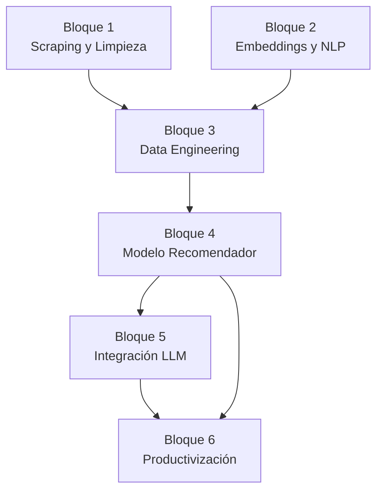

**Stack tecnológico fijado (DECISIÓN-009 a 011):**
- Lenguaje: Python 3.11+
- BD relacional: SQLite (prototipo) → PostgreSQL (escalado)
- BD vectorial: Chroma (prototipo) → pgvector (escalado)
- ORM: SQLAlchemy
- API: FastAPI + Pydantic
- Embeddings: `paraphrase-multilingual-MiniLM-L12-v2` o `multilingual-e5-large` (pendiente DECISIÓN-006b)
- Interfaces: Streamlit (prototipo)

---


---

## Bloque 1 — Scraping y Limpieza de Datos

### Descripción

El Bloque 1 es la capa de ingestión de datos del sistema. Extrae información de paquetes turísticos de TUI (tres mercados: ES, DE, UK), reseñas de TripAdvisor y Reddit, indicadores estadísticos de Eurostat/INE/UNWTO, y datos de ocupación de Booking.com. Los datos crudos se limpian y normalizan antes de persistirlos en el Repositorio.

### Arquitectura del Bloque 1

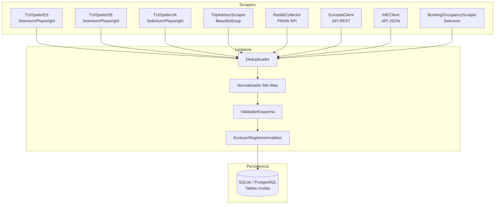

### Componentes e Interfaces

#### ScraperOrchestrator

Coordina la ejecución de todos los scrapers según el calendario de refresco configurado. Gestiona reintentos y errores.

```python
class ScraperOrchestrator:
    def run_cycle(self, sources: list[str]) -> ExtractionReport
    def schedule(self, cron_expr: str) -> None
    def get_last_run_status(self) -> dict[str, RunStatus]
```

#### TUISpider (base común para los tres mercados)

```python
class TUISpider:
    market: str  # "es" | "de" | "uk"
    base_url: str

    def extract_packages(self, region: str) -> list[RawPaquete]
    def extract_package_detail(self, url: str) -> RawPaquete
    def handle_http_error(self, url: str, status_code: int) -> None
```

**Método de acceso:** Selenium/Playwright para renderizado JS. Política de reintentos: 3 intentos con backoff exponencial (1s, 2s, 4s). Respeta `robots.txt`.


#### RedditCollector

```python
class RedditCollector:
    subreddits: list[str]  # r/travel, r/solotravel, r/backpacking, r/Flights, r/TravelHacks, r/vacation

    def collect_posts(self, destination: str, limit: int = 100) -> list[RawResena]
    def collect_comments(self, post_id: str) -> list[RawResena]
```

**Acceso:** API oficial PRAW. Límite: 100 req/min. Credenciales via variables de entorno.

#### StatisticsClient (Eurostat / INE / UNWTO)

```python
class StatisticsClient:
    source: str  # "eurostat" | "ine" | "unwto"

    def fetch_occupancy(self, destination: str, year: int, month: int) -> IndicadorDestino
    def fetch_arrivals(self, country: str, year: int) -> IndicadorDestino
```

#### DataCleaner (Limpiador)

```python
class DataCleaner:
    def deduplicate(self, records: list[RawPaquete]) -> list[RawPaquete]
    def normalize_minmax(self, df: pd.DataFrame, columns: list[str]) -> pd.DataFrame
    def validate_schema(self, record: RawPaquete) -> ValidationResult
    def exclude_invalid(self, records: list[RawPaquete], threshold: float = 0.30) -> tuple[list[RawPaquete], list[ExclusionLog]]
```

**Regla de exclusión (RF-1.8):** Si un registro tiene más del 30% de sus atributos obligatorios vacíos tras la limpieza, se marca como inválido y se excluye del entrenamiento, registrando el motivo.

**Regla de deduplicación (RF-1.6):** Clave de unicidad = `(destino_nombre, nombre_hotel, fecha_salida, fecha_vuelta, ciudad_salida)`. En caso de duplicado, se conserva el registro con `fecha_extraccion` más reciente.

### Modelos de Datos (Tablas SQLite/PostgreSQL)

#### Tabla `paquetes`

Corresponde íntegramente al esquema ENTIDAD PAQUETE definido en DECISIÓN-005. Campos clave para el pipeline:

| Campo clave | Tipo | Uso en pipeline |
|-------------|------|----------------|
| `id_paquete` | VARCHAR(36) PK | Clave de referencia en embeddings e interacciones |
| `descripcion_texto` | TEXT | Input principal para embeddings NLP |
| `nivel_ocupacion` | FLOAT [0,1] | Input para TDRS y vector de features |
| `precio_base_eur` | FLOAT | Feature normalizada para vector híbrido |
| `temporada` | VARCHAR(10) | Calculado: Alta/Media/Baja según fechas |
| `embedding_id` | VARCHAR(36) FK | Referencia al vector en Chroma/pgvector |

#### Tabla `resenas`

Esquema completo según DECISIÓN-005. Campo crítico: `texto_original` (input para embedding de reputación).

#### Tabla `indicadores_destino`

Esquema completo según DECISIÓN-005. Campo crítico: `nivel_ocupacion` calculado a partir de `pernoctaciones_anuales` y capacidad máxima del destino.

### Flujo de Datos del Bloque 1

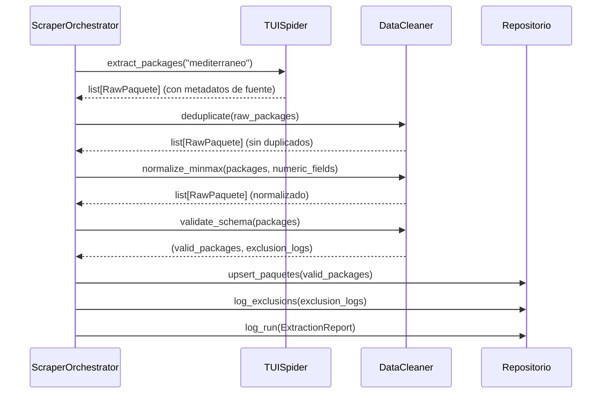

### Cálculo de Temporada

```python
def calcular_temporada(fecha_salida: date) -> str:
    """
    Alta:  junio, julio, agosto, diciembre
    Baja:  enero, febrero, marzo, noviembre
    Media: abril, mayo, septiembre, octubre
    """
    mes = fecha_salida.month
    if mes in [6, 7, 8, 12]:
        return "Alta"
    elif mes in [1, 2, 3, 11]:
        return "Baja"
    else:
        return "Media"
```

### Propiedades de Corrección (PBT relevantes)

- **PBT-7:** Para cualquier registro con `nivel_ocupacion > 1` o `precio_base_eur < 0`, el `DataCleaner` lanza `ValidationError` tipada.
- **RF-1.7:** Tras la normalización min-max, todos los campos numéricos del conjunto procesado están en [0, 1].

---


## Bloque 2 — Embeddings y NLP

### Descripción

El Bloque 2 transforma las representaciones textuales de paquetes y reseñas en vectores semánticos de dimensión fija, y los fusiona con atributos estructurados normalizados para producir el vector híbrido final de cada paquete. Este vector es el que ingresa al modelo recomendador.

### Arquitectura del Bloque 2

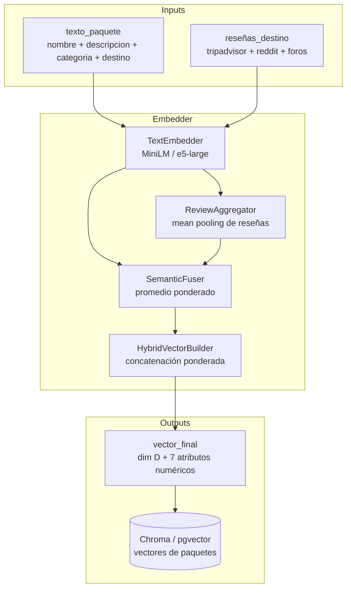

### Componentes e Interfaces

#### TextEmbedder

```python
class TextEmbedder:
    model_name: str       # configurado en config.yml
    model_version: str    # documentado para reproducibilidad (NF-3.2)
    embedding_dim: int    # 384 (MiniLM) o 1024 (e5-large)

    def embed_text(self, text: str) -> np.ndarray  # shape: (D,)
    def embed_batch(self, texts: list[str], batch_size: int = 64) -> np.ndarray  # shape: (N, D)
```

**Modelo candidato 1:** `paraphrase-multilingual-MiniLM-L12-v2` — 384 dimensiones, 50+ idiomas, ~500 MB RAM.
**Modelo candidato 2:** `multilingual-e5-large` — 1024 dimensiones, 100+ idiomas, ~2.5 GB RAM.
La selección final se documenta en DECISIÓN-006b tras el experimento de comparación de clusters.

#### ReviewAggregator

```python
class ReviewAggregator:
    def aggregate(self, review_embeddings: np.ndarray) -> np.ndarray:
        """Mean pooling de todos los embeddings de reseñas de un destino."""
        return np.mean(review_embeddings, axis=0)  # shape: (D,)
```

#### SemanticFuser

```python
class SemanticFuser:
    package_weight: float = 0.6   # peso del embedding del paquete
    review_weight: float  = 0.4   # peso del embedding de reputación

    def fuse(self, package_emb: np.ndarray, review_emb: np.ndarray) -> np.ndarray:
        """Promedio ponderado de embedding de paquete y embedding de reseñas."""
        return self.package_weight * package_emb + self.review_weight * review_emb
```

Los pesos son hiperparámetros configurables en `config.yml` (DECISIÓN-008).


#### HybridVectorBuilder

Implementa la fusión ponderada definida en DECISIÓN-008:

```python
class HybridVectorBuilder:
    weights: dict[str, float]  # w1..w7 configurables en config.yml

    # Pesos por defecto (DECISIÓN-008):
    # precio_base_eur      -> w1 = 1.0
    # duracion_dias        -> w2 = 0.5
    # nivel_ocupacion      -> w3 = 1.5  (mayor peso — clave para TDRS)
    # accesibilidad_destino -> w4 = 0.8
    # estrellas_hotel      -> w5 = 0.7
    # num_valoraciones_hotel -> w6 = 0.6
    # indicador_sostenibilidad -> w7 = 1.0

    def build(self, semantic_vector: np.ndarray, structured_attrs: dict[str, float]) -> np.ndarray:
        """
        Retorna vector_final = [semantic_vector | w1*precio | w2*duracion | ... | w7*sostenibilidad]
        Dimensión: D + 7
        """
        numeric_part = np.array([
            self.weights['w1'] * structured_attrs['precio_base_eur_norm'],
            self.weights['w2'] * structured_attrs['duracion_dias_norm'],
            self.weights['w3'] * structured_attrs['nivel_ocupacion'],
            self.weights['w4'] * structured_attrs['accesibilidad_destino_norm'],
            self.weights['w5'] * structured_attrs['estrellas_hotel_norm'],
            self.weights['w6'] * structured_attrs['num_valoraciones_hotel_norm'],
            self.weights['w7'] * float(structured_attrs['indicador_sostenibilidad_tui']),
        ])
        return np.concatenate([semantic_vector, numeric_part])
```

### Flujo de Generación de Embeddings

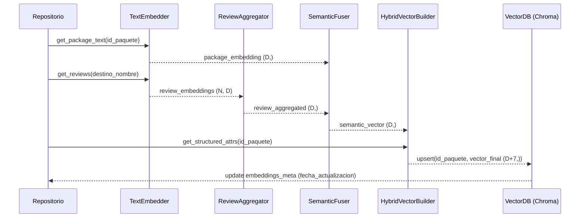

### Gestión Multilingüe

Los tres mercados de TUI producen textos en español, alemán e inglés. Ambos modelos candidatos son multilingües y no requieren traducción previa. El campo `idioma` de la entidad RESEÑA (detectado automáticamente con `langdetect`) permite filtrar reseñas por idioma si fuera necesario para análisis específicos.

### Propiedades de Corrección (PBT relevantes)

- **PBT-5 (round-trip):** `deserializar(serializar(vector_final)) == vector_final` — verificado para embeddings NumPy serializados como JSON y como ficheros `.npy`.
- **RF-3.3:** La dimensión del vector de salida es constante independientemente de la longitud del texto de entrada.
- **RF-3.6:** Para paquetes semánticamente equivalentes (mismo destino, categoría, temporada), la similitud coseno entre sus embeddings debe ser > 0,85.

---


## Bloque 3 — Data Engineering

### Descripción

El Bloque 3 centraliza el almacenamiento estructurado y vectorial, la capa de acceso a datos vía FastAPI y la gestión de interacciones (reales y sintéticas). Es la columna vertebral que conecta el pipeline de ingestión con el modelo recomendador.

### Arquitectura del Bloque 3

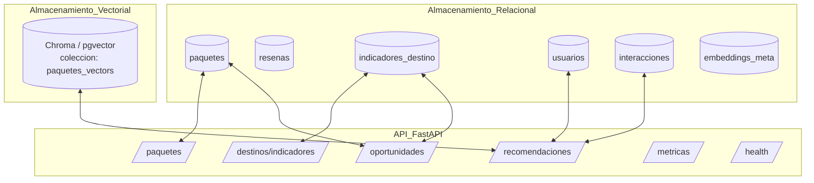

### Esquema de Base de Datos

#### Tabla `usuarios`

```sql
CREATE TABLE usuarios (
    id_usuario      VARCHAR(36) PRIMARY KEY,
    es_sintetico    BOOLEAN NOT NULL DEFAULT TRUE,
    -- Preferencias temáticas [0,1] — suma = 1.0 ± 0.01
    pref_cultura    FLOAT NOT NULL,
    pref_gastronomia FLOAT NOT NULL,
    pref_naturaleza FLOAT NOT NULL,
    pref_playa      FLOAT NOT NULL,
    pref_bienestar  FLOAT NOT NULL,
    pref_aventura   FLOAT NOT NULL,
    -- Restricciones
    presupuesto_min_eur  FLOAT NOT NULL,
    presupuesto_max_eur  FLOAT NOT NULL,
    duracion_min_dias    INT NOT NULL,
    duracion_max_dias    INT NOT NULL,
    temporada_preferida  VARCHAR(10),   -- Alta / Media / Baja
    requiere_accesibilidad BOOLEAN NOT NULL DEFAULT FALSE,
    distancia_max_km     FLOAT,
    interes_sostenibilidad FLOAT NOT NULL,  -- [0,1]
    -- Metadatos
    fecha_creacion  TIMESTAMP NOT NULL DEFAULT CURRENT_TIMESTAMP,
    seed_generacion INT       -- semilla usada si es sintético
);
```

#### Tabla `interacciones`

```sql
CREATE TABLE interacciones (
    id_interaccion  VARCHAR(36) PRIMARY KEY,
    id_usuario      VARCHAR(36) NOT NULL REFERENCES usuarios(id_usuario),
    id_paquete      VARCHAR(36) NOT NULL REFERENCES paquetes(id_paquete),
    tipo            VARCHAR(20) NOT NULL,  -- 'visualizacion' | 'reserva' | 'valoracion'
    valor           FLOAT,                 -- puntuación 1-5 si tipo='valoracion', NULL si no aplica
    timestamp_interaccion TIMESTAMP NOT NULL DEFAULT CURRENT_TIMESTAMP
);
```

#### Tabla `embeddings_meta`

```sql
CREATE TABLE embeddings_meta (
    id_paquete      VARCHAR(36) PRIMARY KEY REFERENCES paquetes(id_paquete),
    modelo_nombre   VARCHAR(100) NOT NULL,
    modelo_version  VARCHAR(50)  NOT NULL,
    embedding_dim   INT NOT NULL,
    fecha_generacion TIMESTAMP NOT NULL,
    chroma_id       VARCHAR(36)  -- ID interno en la colección Chroma
);
```

### Generación de Usuarios Sintéticos

Componente crítico para el entrenamiento dado que no hay historial real de interacciones.

```python
class SyntheticUserGenerator:
    random_seed: int  # fijado — NF-3.1

    def generate_batch(self, n: int = 500) -> list[UsuarioPerfil]:
        """
        Genera N perfiles coherentes:
        - Preferencias temáticas via Dirichlet(alpha=[1,1,1,1,1,1]) → suma = 1.0
        - Presupuesto: lognormal(mu=7.0, sigma=0.5) → range [300, 5000] EUR
        - Duración: randint(3, 21) días
        - Accesibilidad: Bernoulli(0.15)
        - Interés sostenibilidad: Beta(2, 5) → sesgado hacia valores bajos/medios
        """

    def validate_coherence(self, profile: UsuarioPerfil) -> bool:
        """RF-2.2: suma preferencias ∈ [0.99, 1.01]"""
        return abs(sum([
            profile.pref_cultura, profile.pref_gastronomia,
            profile.pref_naturaleza, profile.pref_playa,
            profile.pref_bienestar, profile.pref_aventura
        ]) - 1.0) <= 0.01
```


### Capa API FastAPI

#### Modelos Pydantic

```python
class PerfilViajeroRequest(BaseModel):
    pref_cultura: float = Field(ge=0.0, le=1.0)
    pref_gastronomia: float = Field(ge=0.0, le=1.0)
    pref_naturaleza: float = Field(ge=0.0, le=1.0)
    pref_playa: float = Field(ge=0.0, le=1.0)
    pref_bienestar: float = Field(ge=0.0, le=1.0)
    pref_aventura: float = Field(ge=0.0, le=1.0)
    presupuesto_min_eur: float = Field(gt=0)
    presupuesto_max_eur: float = Field(gt=0)
    duracion_min_dias: int = Field(ge=1)
    duracion_max_dias: int = Field(ge=1)
    temporada_preferida: Optional[str] = None
    requiere_accesibilidad: bool = False
    distancia_max_km: Optional[float] = None
    interes_sostenibilidad: float = Field(ge=0.0, le=1.0)

    @validator('*')
    def preferencias_suman_uno(cls, v, values):
        # Validación cross-field de coherencia de preferencias

class RecomendacionRequest(BaseModel):
    perfil: PerfilViajeroRequest
    escenario: str = Field(default="moderado", pattern="^(tradicional|moderado|intensivo)$")
    top_k: int = Field(default=10, ge=1, le=50)

class PaqueteRecomendado(BaseModel):
    id_paquete: str
    nombre_paquete: str
    destino_nombre: str
    precio_base_eur: float
    categoria: str
    score_afinidad: float   # [0,1]
    tdrs: float             # [-1,1]
    score_final: float
    descripcion_llm: Optional[str] = None
    explicacion: ExplicacionFactores

class ExplicacionFactores(BaseModel):
    afinidad: float
    tdrs: float
    saturacion: float
    posicion_ranking_tradicional: Optional[int] = None
    posicion_ranking_redistributivo: Optional[int] = None
    motivo_cambio_posicion: Optional[str] = None
```

#### Endpoints Principales

```python
@app.post("/recomendaciones", response_model=list[PaqueteRecomendado])
async def get_recomendaciones(request: RecomendacionRequest):
    """
    Tiempo de respuesta objetivo: < 3s e2e (NF-1.1)
    Incluye: Afinidad + TDRS + Score_Final + explicabilidad
    """

@app.get("/paquetes", response_model=list[PaqueteResumen])
async def list_paquetes(
    region: Optional[str] = None,
    categoria: Optional[str] = None,
    temporada: Optional[str] = None,
    page: int = 1,
    page_size: int = 20
):
    """Listado paginado con filtros. Latencia < 500ms."""

@app.get("/oportunidades", response_model=list[OportunidadMercado])
async def get_oportunidades(
    zona: Optional[str] = None,      # Mediterráneo | Caribe
    temporada: Optional[str] = None,
    umbral: float = 0.20
):
    """Destinos con indicador_oportunidad > umbral, ordenados descendente."""

@app.get("/health", response_model=HealthStatus)
async def health_check():
    """Estado de cada módulo: Scraper, Repositorio, Modelo_Afinidad, LLM_Adapter."""

@app.get("/metricas", response_model=MetricasModelo)
async def get_metricas():
    """Precision@K, NDCG@K, Gini_Turístico, CR5 del ciclo más reciente."""
```

### Gestión de Versiones del Catálogo (RF-4.5)

Cada actualización de un paquete se registra en una tabla de auditoría:

```sql
CREATE TABLE paquetes_versiones (
    id_version      VARCHAR(36) PRIMARY KEY,
    id_paquete      VARCHAR(36) NOT NULL REFERENCES paquetes(id_paquete),
    timestamp_version TIMESTAMP NOT NULL,
    hash_contenido  VARCHAR(64) NOT NULL,  -- SHA-256 del JSON del registro
    datos_snapshot  JSONB,                 -- snapshot completo del registro
    campo_modificado VARCHAR(50)
);
```

Esto permite reconstruir el estado del catálogo en cualquier fecha anterior.

### Política de Reintentos (RF-4.6)

```python
class RetryPolicy:
    max_attempts: int = 3
    delays: list[float] = [1.0, 2.0, 4.0]  # segundos (exponencial)

    async def execute_with_retry(self, operation: Callable, *args) -> Any:
        for attempt, delay in enumerate(self.delays):
            try:
                return await operation(*args)
            except RepositoryError as e:
                if attempt == len(self.delays) - 1:
                    logger.error(f"Fallo definitivo tras {self.max_attempts} intentos: {e}")
                    raise
                await asyncio.sleep(delay)
```

---


## Bloque 4 — Modelo Recomendador (Afinidad, TDRS, Re-ranking)

### Descripción

El Bloque 4 es el núcleo algorítmico del sistema. Comprende tres sub-componentes: (1) el Modelo de Afinidad que puntúa la compatibilidad usuario-paquete, (2) el cálculo del TDRS que introduce los criterios de redistribución, y (3) el Motor de Re-ranking que produce el ranking final en tres escenarios diferenciados.

### Arquitectura del Bloque 4

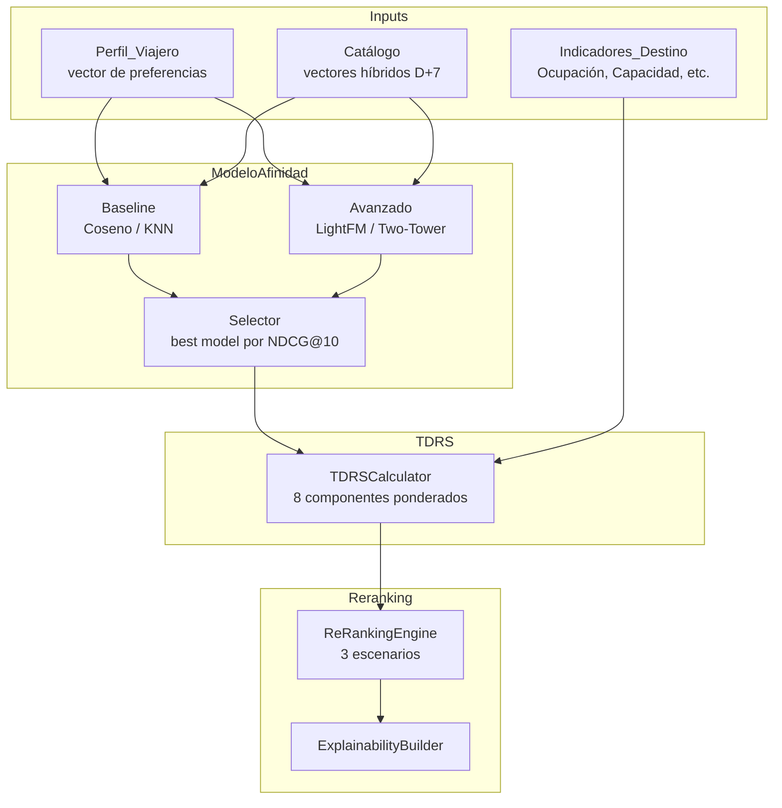

### Sub-componente 4.1: Modelo de Afinidad

#### Baseline: Similitud del Coseno

```python
class CosineAffinityModel:
    def score(self, user_vector: np.ndarray, package_vector: np.ndarray) -> float:
        """
        Afinidad(u, e) = coseno(vector_usuario, vector_paquete)
        Normalizado a [0,1]: (coseno + 1) / 2
        Postcondición: resultado ∈ [0,1]  (PBT-1)
        """
        cos = np.dot(user_vector, package_vector) / (
            np.linalg.norm(user_vector) * np.linalg.norm(package_vector) + 1e-8
        )
        return (cos + 1.0) / 2.0

    def top_k(self, user_vector: np.ndarray, catalog_vectors: np.ndarray, k: int) -> list[int]:
        """Retorna índices de los K paquetes más afines. Latencia < 100ms para 10K paquetes."""
        scores = np.dot(catalog_vectors, user_vector) / (
            np.linalg.norm(catalog_vectors, axis=1) * np.linalg.norm(user_vector) + 1e-8
        )
        return np.argsort(scores)[::-1][:k].tolist()
```

**Vector del usuario:** Se construye como promedio ponderado de los vectores de los paquetes con los que ha interaccionado (con peso por tipo: `valoracion=1.0`, `reserva=0.8`, `visualizacion=0.3`). Para usuarios sintéticos sin historial, se construye a partir de las preferencias temáticas del perfil.

#### Modelo Avanzado: LightFM (opción principal) / Two-Tower (opción alternativa)

**LightFM** es el modelo avanzado preferido por su capacidad de manejar el problema cold-start (usuarios y paquetes nuevos sin historial) mediante representaciones de features:

```python
class LightFMAffinityModel:
    model: LightFM  # WARP loss para implicit feedback
    item_features: csr_matrix   # features de paquetes (categoría, destino, temporada...)
    user_features: csr_matrix   # features de usuarios (preferencias, presupuesto...)

    def train(
        self,
        interactions: csr_matrix,   # matriz usuario x paquete
        epochs: int = 30,
        num_threads: int = 4,
        random_state: int = 42      # NF-3.1
    ) -> None: ...

    def score(self, user_id: int, item_id: int) -> float:
        """Retorna puntuación normalizada [0,1]. Postcondición: PBT-1."""

    def top_k(self, user_id: int, k: int) -> list[int]:
        """Top-K por usuario. Latencia < 100ms por usuario (RF-5.2)."""
```

**Objetivo de métricas (RF-5.4):** Precision@10 ≥ 0,30 y NDCG@10 ≥ 0,35 en el conjunto de test.


### Sub-componente 4.2: Cálculo del TDRS

El TDRS es el índice compuesto que evalúa cada paquete desde la perspectiva de redistribución turística.

#### Fórmula (RF-6.1)

```
TDRS = w₁·Afinidad + w₂·Capacidad + w₃·Accesibilidad + w₄·Impacto_Local
     + w₅·Temporada_Baja + w₆·Diversificación − w₇·Ocupación − w₈·Sensibilidad_Ambiental
```

Donde: todos los términos ∈ [0,1], Σ|wᵢ| = 1,0, TDRS ∈ [−1, 1].

#### Implementación

```python
class TDRSCalculator:
    # Pesos configurables en config.yml (RF-6.2)
    w1: float = 0.20  # Afinidad
    w2: float = 0.15  # Capacidad disponible
    w3: float = 0.10  # Accesibilidad del destino
    w4: float = 0.10  # Impacto local positivo
    w5: float = 0.15  # Temporada baja (1 si Baja, 0.5 si Media, 0 si Alta)
    w6: float = 0.10  # Diversificación (inverso de popularidad del destino)
    w7: float = 0.15  # Ocupación (penalización)
    w8: float = 0.05  # Sensibilidad ambiental (penalización)

    def calculate(
        self,
        afinidad: float,           # [0,1] — salida del Modelo_Afinidad
        capacidad: float,          # [0,1] — plazas disponibles / capacidad total
        accesibilidad: float,      # [0,1] — normalizado de escala 1-3
        impacto_local: float,      # [0,1] — calculado de fuentes de datos
        temporada_baja: float,     # [0,1]
        diversificacion: float,    # [0,1] — 1 - (popularidad relativa del destino)
        ocupacion: float,          # [0,1] — penalización
        sensibilidad_ambiental: float  # [0,1] — penalización
    ) -> float:
        """
        Postcondición: resultado ∈ [-1, 1]  (PBT-1, RF-6.3)
        Monotonía: mayor ocupacion => menor TDRS  (PBT-3)
        """
        assert 0 <= afinidad <= 1, "Afinidad fuera de rango"
        assert 0 <= ocupacion <= 1, "Ocupación fuera de rango"

        # RF-6.4: si ocupacion > 0.85, forzar a 1.0
        if ocupacion > 0.85:
            ocupacion = 1.0

        tdrs = (
            self.w1 * afinidad
            + self.w2 * capacidad
            + self.w3 * accesibilidad
            + self.w4 * impacto_local
            + self.w5 * temporada_baja
            + self.w6 * diversificacion
            - self.w7 * ocupacion
            - self.w8 * sensibilidad_ambiental
        )
        return max(-1.0, min(1.0, tdrs))  # clamp por seguridad

    def recalculate_for_destination(self, destino_id: str) -> int:
        """RF-6.5: recalcular TDRS de todos los paquetes del destino. Retorna nº paquetes actualizados."""
```

**Verificación de la propiedad PBT-3 (monotonía):**
Para cualquier paquete con todos los demás factores constantes: `ocupacion(e1) > ocupacion(e2) ⟹ TDRS(e1) ≤ TDRS(e2)`. Esto se garantiza porque el término `−w7·Ocupación` es monótonamente decreciente en `ocupacion` y `w7 > 0`.

### Sub-componente 4.3: Motor de Re-ranking

```python
class ReRankingEngine:
    # Coeficientes de los 3 escenarios (configurables en runtime sin reentrenamiento — RF-7.5)
    SCENARIOS = {
        "tradicional": {
            "alpha": 1.0, "beta": 0.0, "gamma": 0.0, "delta": 0.0, "lambda_": 0.0
        },
        "moderado": {
            "alpha": 0.5, "beta": 0.2, "gamma": 0.15, "delta": 0.10, "lambda_": 0.05
        },
        "intensivo": {
            "alpha": 0.25, "beta": 0.30, "gamma": 0.20, "delta": 0.15, "lambda_": 0.10
        }
    }
    # Invariante: alpha + beta + gamma + delta + lambda_ = 1.0  (RF-7.1)

    def score_final(
        self,
        score_base: float,       # afinidad del modelo [0,1]
        redistribucion: float,   # componente de redistribución [0,1]
        sostenibilidad: float,   # indicador sostenibilidad [0,1]
        capacidad: float,        # capacidad disponible [0,1]
        saturacion: float,       # nivel de saturación [0,1]
        escenario: str = "moderado"
    ) -> float:
        """
        Score_Final = α·Base + β·Redistrib + γ·Sostenib + δ·Capacidad − λ·Saturación
        Postcondición: determinista — mismo input => mismo output  (PBT-2, RF-7.6)
        """
        c = self.SCENARIOS[escenario]
        return (
            c["alpha"]   * score_base
            + c["beta"]    * redistribucion
            + c["gamma"]   * sostenibilidad
            + c["delta"]   * capacidad
            - c["lambda_"] * saturacion
        )

    def rank(
        self,
        candidates: list[PaqueteCandidate],
        escenario: str = "moderado",
        k: int = 10
    ) -> list[PaqueteRecomendado]:
        """
        1. Calcula Score_Final para cada candidato
        2. Ordena descendente por Score_Final
        3. Desempate: orden alfabético por id_paquete (RF-7.7)
        4. Retorna top-K
        Latencia: < 500ms para K=10  (RF-7.4)
        """
        scored = [(p, self.score_final(..., escenario=escenario)) for p in candidates]
        scored.sort(key=lambda x: (-x[1], x[0].id_paquete))
        return [self._to_recomendado(p, s) for p, s in scored[:k]]

    def rank_all_scenarios(
        self,
        candidates: list[PaqueteCandidate],
        k: int = 10
    ) -> dict[str, list[PaqueteRecomendado]]:
        """Retorna los 3 rankings en una sola llamada. RF-7.2."""
        return {
            escenario: self.rank(candidates, escenario, k)
            for escenario in self.SCENARIOS
        }
```


### Sub-componente 4.4: Explicabilidad (RF-9)

```python
class ExplainabilityBuilder:
    def build(
        self,
        paquete: Paquete,
        afinidad: float,
        tdrs: float,
        saturacion: float,
        ranking_tradicional: list[str],  # ids en orden
        ranking_redistributivo: list[str]
    ) -> ExplicacionFactores:
        """
        RF-9.1: desglose de factores (afinidad, TDRS, saturación)
        RF-9.3: si posición difiere entre rankings, indicar el motivo
        Latencia: < 200ms adicionales  (RF-9.4)
        """
        pos_trad = ranking_tradicional.index(paquete.id_paquete) + 1 if paquete.id_paquete in ranking_tradicional else None
        pos_redis = ranking_redistributivo.index(paquete.id_paquete) + 1 if paquete.id_paquete in ranking_redistributivo else None

        motivo = None
        if pos_trad and pos_redis and pos_trad != pos_redis:
            if pos_redis < pos_trad:
                motivo = f"Ascendió {pos_trad - pos_redis} posiciones por bajo nivel de saturación y temporada favorable"
            else:
                motivo = f"Descendió {pos_redis - pos_trad} posiciones por alta ocupación del destino"

        return ExplicacionFactores(
            afinidad=round(afinidad, 3),
            tdrs=round(tdrs, 3),
            saturacion=round(saturacion, 3),
            posicion_ranking_tradicional=pos_trad,
            posicion_ranking_redistributivo=pos_redis,
            motivo_cambio_posicion=motivo
        )
```

### Detección de Oportunidades de Mercado (RF-10)

```python
class MarketOpportunityDetector:
    umbral: float = 0.20  # configurable

    def calculate_opportunity_score(
        self, afinidad_media_destino: float, nivel_ocupacion: float
    ) -> float:
        """
        indicador_oportunidad = afinidad_media - nivel_ocupacion
        RF-10.2: destino con oportunidad si indicador > umbral
        """
        return afinidad_media_destino - nivel_ocupacion

    def detect_opportunities(
        self, destinos: list[DestinoStats]
    ) -> list[OportunidadMercado]:
        """
        Agrega por zona geográfica y temporada. RF-10.3.
        Asocia perfil de usuario más frecuentemente afín. RF-10.5.
        """
```

### Simulación de Impacto Territorial (RF-11)

```python
class TerritorialImpactSimulator:
    def simulate(
        self,
        users: list[UsuarioPerfil],   # mínimo 500 (RF-11.1)
        escenarios: list[str] = ["tradicional", "moderado", "intensivo"]
    ) -> dict[str, SimulationResult]:
        """
        Para cada escenario calcula: Gini_Turístico, CR5, %demanda_saturacion<0.5
        RF-11.5: < 60s en entorno con 4 núcleos
        """

    def calcular_gini(self, demand_distribution: list[float]) -> float:
        """Coeficiente de Gini de la distribución de demanda entre destinos."""

    def calcular_cr5(self, demand_distribution: dict[str, float]) -> float:
        """Concentración en los 5 destinos más demandados."""

    def export_csv(self, results: dict[str, SimulationResult], path: str) -> None:
        """RF-11.3: exportar resultados en CSV."""
```

---


## Bloque 5 — Integración con LLM

### Descripción

El Bloque 5 transforma el ranking numérico producido por el Motor de Re-ranking en texto personalizado comprensible para el viajero. Su responsabilidad es generar una descripción en lenguaje natural para cada uno de los **top-3 paquetes recomendados**, adaptada al idioma del mercado del usuario (es/de/en) y enriquecida con referencias a sus preferencias y, cuando procede, a los beneficios de sostenibilidad del destino.

El bloque sigue la **DECISIÓN-012**: el modelo principal es GPT-4o-mini (API OpenAI) con fallback automático a plantillas predefinidas cuando la API no responde, devuelve error o se supera el presupuesto configurado.

**Flujo resumido:** para cada uno de los tres paquetes top se realiza una llamada independiente a la API OpenAI (tres llamadas totales por solicitud de recomendación). Si alguna falla, se activa el motor de plantillas para ese paquete concreto sin afectar a los demás.

### Arquitectura del Bloque 5

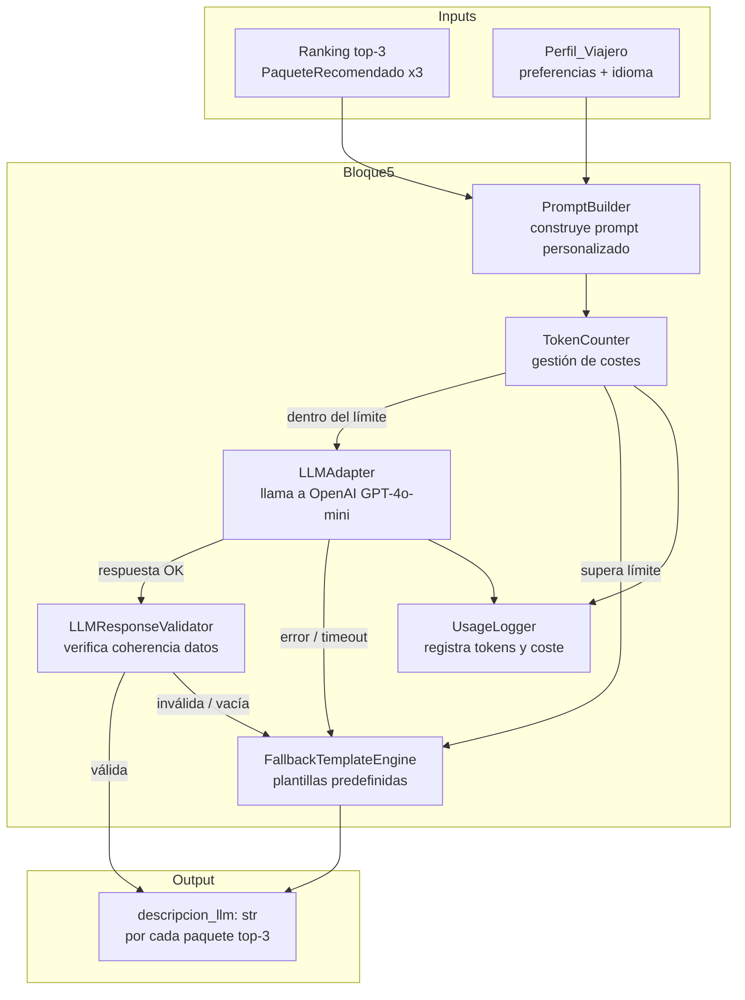

### Componentes e Interfaces

#### LLMAdapter

Abstracción sobre la API de OpenAI. Permite cambiar de modelo (GPT-4o-mini → otro) mediante configuración sin tocar el resto del código.

```python
class LLMAdapter:
    """
    Abstracción sobre la API de OpenAI.
    El nombre y versión del modelo se leen de config.yml (RF-8.6).
    No hay modelo hardcodeado en el código fuente.
    """
    model_name: str       # leído de config — ej: "gpt-4o-mini"
    api_key: str          # leído de variable de entorno OPENAI_API_KEY
    timeout_seconds: float = 10.0    # timeout por llamada
    max_tokens_output: int = 300     # límite de tokens en la respuesta

    def generate(self, prompt: str) -> LLMResponse:
        """
        Envía el prompt a la API de OpenAI y retorna la respuesta.
        Lanza LLMTimeoutError si supera timeout_seconds.
        Lanza LLMRateLimitError si recibe HTTP 429.
        Lanza LLMUnavailableError para HTTP 5xx o error de red.
        Lanza LLMEmptyResponseError si la respuesta llega vacía.
        Tiempo objetivo: < 5s por llamada en condiciones normales (RF-8.4).
        """

    def is_available(self) -> bool:
        """Comprueba si la API está accesible (health check ligero)."""
```

#### PromptBuilder

Construye el prompt personalizado para cada paquete, inyectando campos del perfil del usuario y datos del paquete.

```python
class PromptBuilder:
    """
    Construye el prompt personalizado combinando:
      - Datos del paquete: nombre, destino, categoría, precio, duración, temporada, TDRS
      - Datos del perfil: preferencia temática dominante, presupuesto, temporada preferida
      - Idioma de salida: detectado del campo `mercado` del perfil (es/de/en)
    """

    def build(self, paquete: PaqueteRecomendado, perfil: PerfilViajeroRequest) -> str:
        """
        Retorna el prompt listo para enviar al LLM.
        Postcondición (RF-8.2): el prompt contiene al menos uno de:
          - nombre de la preferencia temática dominante del perfil
          - rango de presupuesto (min-max EUR)
          - temporada preferida
        Postcondición (RF-8.3): si paquete.tdrs > 0.6, el prompt incluye
          instrucción explícita de mencionar sostenibilidad/redistribución.
        """

    def _preferencia_dominante(self, perfil: PerfilViajeroRequest) -> str:
        """Retorna la clave de la preferencia con mayor valor en el perfil."""

    def _detectar_idioma(self, perfil: PerfilViajeroRequest) -> str:
        """Retorna 'es', 'de' o 'en' según el mercado del perfil."""
```

**Template base del prompt** (texto inyectado en el `user` message de la API):

```
Eres un asistente especializado en turismo. Escribe una descripción personalizada de 2-3 frases
en {idioma} para un viajero con las siguientes características:
- Preferencia principal: {preferencia_dominante}
- Presupuesto: entre {presupuesto_min}€ y {presupuesto_max}€
- Duración preferida: {duracion_min}-{duracion_max} días
- Temporada preferida: {temporada_preferida}

El paquete a describir es:
- Destino: {destino_nombre} ({pais})
- Nombre: {nombre_paquete}
- Categoría: {categoria}
- Precio: {precio_base_eur}€ ({duracion_dias} días, {temporada})
- Hotel: {nombre_hotel} ({estrellas_hotel} estrellas)
{bloque_sostenibilidad}

Escribe SOLO la descripción, sin encabezados ni listas. No inventes datos que no estén en la información proporcionada.
```

Donde `{bloque_sostenibilidad}` se inyecta únicamente si `paquete.tdrs > 0.6`:

```
- Este destino tiene un perfil de sostenibilidad destacado (TDRS={tdrs:.2f}).
  Menciona brevemente el beneficio de redistribución o sostenibilidad en la descripción.
```

#### FallbackTemplateEngine

Genera texto desde plantillas predefinidas cuando el LLM no está disponible.

```python
class FallbackTemplateEngine:
    """
    Motor de plantillas multilingüe para generación de texto sin LLM.
    Se activa ante: LLMUnavailableError, LLMTimeoutError, LLMRateLimitError,
    LLMEmptyResponseError, LLMInvalidResponseError o BudgetExceededError.
    """

    TEMPLATES: dict[str, str] = {
        "es": (
            "{nombre_paquete} en {destino_nombre}: una experiencia de {categoria} "
            "durante {duracion_dias} días desde {precio_base_eur}€. "
            "{frase_preferencia} {frase_sostenibilidad}"
        ),
        "de": (
            "{nombre_paquete} in {destino_nombre}: ein {categoria}-Erlebnis "
            "für {duracion_dias} Tage ab {precio_base_eur}€. "
            "{frase_preferencia} {frase_sostenibilidad}"
        ),
        "en": (
            "{nombre_paquete} in {destino_nombre}: a {categoria} experience "
            "for {duracion_dias} days from {precio_base_eur}€. "
            "{frase_preferencia} {frase_sostenibilidad}"
        ),
    }

    def generate(self, paquete: PaqueteRecomendado, perfil: PerfilViajeroRequest) -> str:
        """
        Genera descripción desde plantilla.
        Postcondición: resultado nunca es vacío ni None.
        Postcondición: resultado contiene destino_nombre y categoria como substrings.
        """
        idioma = self._detectar_idioma(perfil)
        template = self.TEMPLATES.get(idioma, self.TEMPLATES["es"])
        return template.format(
            nombre_paquete=paquete.nombre_paquete,
            destino_nombre=paquete.destino_nombre,
            categoria=paquete.categoria,
            duracion_dias=paquete.duracion_dias,
            precio_base_eur=paquete.precio_base_eur,
            frase_preferencia=self._frase_preferencia(paquete, perfil, idioma),
            frase_sostenibilidad=self._frase_sostenibilidad(paquete, idioma),
        )

    def _frase_preferencia(
        self, paquete: PaqueteRecomendado, perfil: PerfilViajeroRequest, idioma: str
    ) -> str:
        """Frase corta que conecta la preferencia dominante del perfil con el paquete."""

    def _frase_sostenibilidad(self, paquete: PaqueteRecomendado, idioma: str) -> str:
        """Retorna frase de sostenibilidad si tdrs > 0.6, cadena vacía en caso contrario."""
```

#### LLMResponseValidator

Valida que la respuesta del LLM es coherente con los datos del paquete (no alucinó precios, nombres de hotel ni destinos incorrectos).

```python
class LLMResponseValidator:
    """
    Verifica que la descripción generada no contenga datos inventados
    comparándola con los campos del paquete de referencia.
    """

    def validate(self, response: str, paquete: PaqueteRecomendado) -> ValidationResult:
        """
        Comprueba que la respuesta:
        1. No está vacía (longitud > 10 caracteres).
        2. No menciona un precio numéricamente diferente al del paquete (±10%).
        3. No menciona un nombre de hotel diferente al del paquete (si lo menciona).
        4. No menciona un destino diferente al destino del paquete (si lo menciona).
        Retorna ValidationResult(is_valid=True/False, reason=str|None).
        """

    def _extract_prices_from_text(self, text: str) -> list[float]:
        """Extrae valores numéricos precedidos de símbolos de moneda (€, EUR, £)."""

    def _hotel_mentioned_incorrectly(self, text: str, paquete: PaqueteRecomendado) -> bool:
        """True si el texto menciona un nombre de hotel que no coincide con el del paquete."""
```

#### TokenCounter

Estima y controla el consumo de tokens antes de enviar cada petición a OpenAI.

```python
class TokenCounter:
    """
    Estima tokens de un prompt usando tiktoken (misma tokenización que GPT-4o-mini).
    Controla que el consumo acumulado no supere el límite configurado.
    """
    model_name: str = "gpt-4o-mini"
    max_budget_tokens: int  # límite configurable en config.yml
    _tokens_consumed: int = 0  # acumulado en la sesión

    def count_tokens(self, text: str) -> int:
        """
        Retorna el número de tokens del texto para el modelo configurado.
        Postcondición: resultado > 0 para cualquier texto no vacío.
        Usa tiktoken con codificación cl100k_base (GPT-4o-mini).
        """

    def check_budget(self, prompt: str) -> BudgetCheckResult:
        """
        Verifica si enviar este prompt superaría el límite de presupuesto.
        Retorna BudgetCheckResult(allowed=True/False, tokens_estimated=int, tokens_remaining=int).
        """

    def register_usage(self, tokens_input: int, tokens_output: int) -> None:
        """Acumula el uso real reportado por la API de OpenAI tras cada llamada."""

    def estimated_cost_eur(self) -> float:
        """Coste estimado en EUR basado en precios GPT-4o-mini ($0.15/1M input, $0.60/1M output)."""
```

#### UsageLogger

Registra cada llamada a la API para monitorización de costes y diagnóstico.

```python
class UsageLogger:
    """Registra uso de tokens y costes en log estructurado (JSON por línea)."""

    def log_llm_call(
        self,
        id_paquete: str,
        id_usuario: str,
        tokens_input: int,
        tokens_output: int,
        latency_ms: float,
        model: str,
        used_fallback: bool,
        fallback_reason: Optional[str] = None,
    ) -> None:
        """
        Emite entrada de log con todos los campos.
        Si used_fallback=True, registra también el motivo del fallback (RF-8.5).
        """
```

### Flujo de Datos del Bloque 5

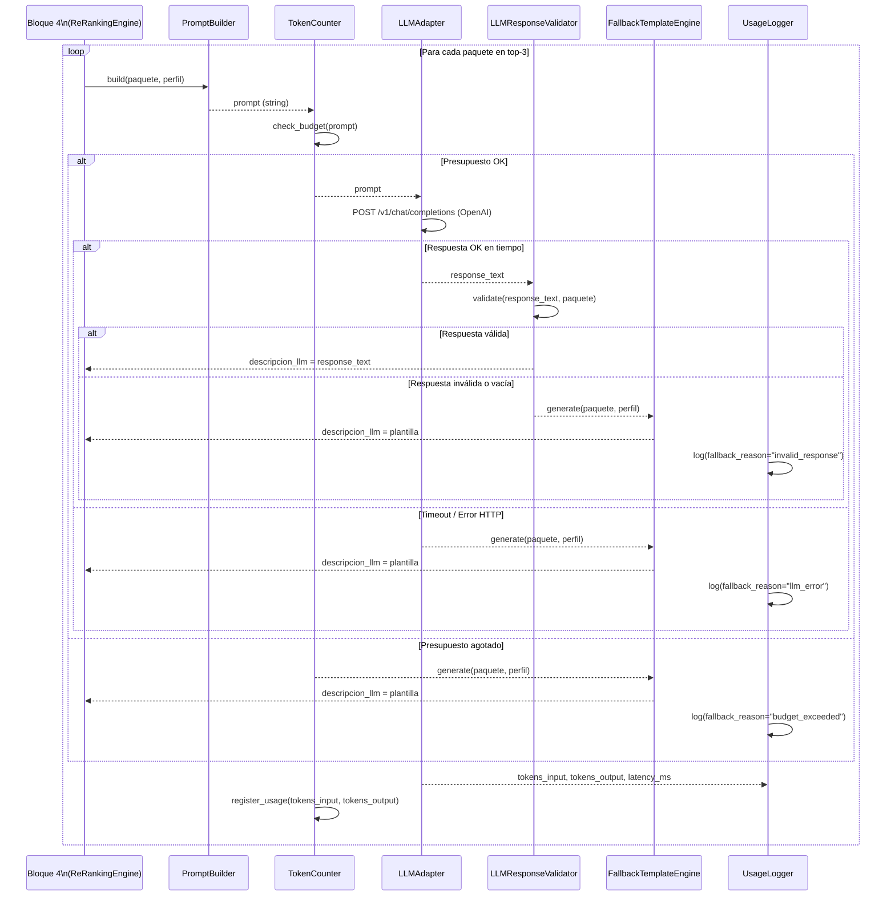

### Control de Costes

**Modelo:** GPT-4o-mini — $0,150 / 1M tokens de entrada, $0,600 / 1M tokens de salida.

**Estimación por llamada:**
- Prompt medio estimado: ~350 tokens de entrada (template + datos del paquete + perfil).
- Respuesta media: ~150 tokens de salida (2-3 frases).
- Coste por llamada: (350 × $0,00000015) + (150 × $0,00000060) ≈ **$0,000143** (~€0,00013).
- Coste por solicitud de recomendación (3 llamadas): ~**$0,000430** (~€0,00040).
- Con presupuesto total de €100: permite hasta ~**250.000 solicitudes** de recomendación completas.

**Mecanismo de control en el código:**

```yaml
# config.yml — sección llm
llm:
  model_name: "gpt-4o-mini"
  max_budget_tokens: 5_000_000   # límite de tokens por sesión/día
  max_tokens_output: 300
  timeout_seconds: 10.0
  fallback_on_budget_exceeded: true
```

El `TokenCounter` estima los tokens antes de cada llamada con `tiktoken` y rechaza la petición si superaría el límite, activando el fallback automáticamente. El `UsageLogger` registra el consumo real reportado por OpenAI en cada respuesta y actualiza el acumulador.

### Política de Fallback

El `FallbackTemplateEngine` se activa en cualquiera de estas condiciones:

| Condición | Excepción | Acción |
|-----------|-----------|--------|
| API no responde en `timeout_seconds` | `LLMTimeoutError` | Fallback para ese paquete |
| HTTP 429 — Rate limit de OpenAI | `LLMRateLimitError` | Fallback inmediato (sin espera) |
| HTTP 5xx — Error interno de OpenAI | `LLMUnavailableError` | Fallback para ese paquete |
| Respuesta vacía o `finish_reason != "stop"` | `LLMEmptyResponseError` | Fallback para ese paquete |
| `LLMResponseValidator` rechaza la respuesta | `LLMInvalidResponseError` | Fallback para ese paquete |
| `TokenCounter` supera límite de presupuesto | `BudgetExceededError` | Fallback para los paquetes restantes |

**Transparencia ante el usuario:** La `App_Usuario` no diferencia entre texto generado por LLM y texto de plantilla. El campo `descripcion_generada_por` en los metadatos internos sí lo registra (útil para métricas del `Dashboard_TUI`).

**Idempotencia del fallback:** `FallbackTemplateEngine` es una función pura — para los mismos datos de entrada siempre produce la misma salida, garantizando reproducibilidad.

### Gestión de Errores

```python
# Jerarquía de excepciones del Bloque 5
class LLMError(Exception): ...
class LLMTimeoutError(LLMError): ...
class LLMRateLimitError(LLMError):
    retry_after_seconds: float  # extraído del header Retry-After de OpenAI
class LLMUnavailableError(LLMError): ...
class LLMEmptyResponseError(LLMError): ...
class LLMInvalidResponseError(LLMError):
    reason: str
class BudgetExceededError(LLMError):
    tokens_consumed: int
    budget_limit: int
```

**Gestión de rate limiting (HTTP 429):** OpenAI devuelve el header `Retry-After: N`. El `LLMAdapter` captura este valor y lo expone en `LLMRateLimitError.retry_after_seconds`. Para el contexto del TFM (carga baja), se activa el fallback inmediatamente sin esperar y se registra la indisponibilidad.

**Timeouts:** El timeout de 10s es conservador. En condiciones normales GPT-4o-mini responde en 1-3s para prompts de ~350 tokens. El margen doble absorbe picos puntuales sin bloquear al usuario más allá de los 5s del RF-8.4.

**Reintentos:** El `LLMAdapter` no reintenta automáticamente (para no consumir budget). El reintento ante errores de red transitoria se delega a la `RetryPolicy` del Bloque 3 (máx. 3 intentos, backoff 1s/2s/4s) únicamente si se invoca desde un contexto de reintento explícito.

### Propiedades de Corrección (PBT relevantes del Bloque 5)

*Una propiedad es una característica o comportamiento que debe ser verdadero en todas las ejecuciones válidas del sistema — esencialmente, una declaración formal sobre lo que el sistema debe hacer. Las propiedades sirven como puente entre las especificaciones legibles por personas y las garantías de corrección verificables automáticamente.*

#### Propiedad B5-1: El prompt siempre contiene personalización del perfil

*Para cualquier* `PerfilViajeroRequest` válido y cualquier `PaqueteRecomendado` válido, el prompt generado por `PromptBuilder.build()` debe contener al menos uno de: el nombre de la preferencia temática dominante del perfil, el rango de presupuesto del perfil, o la temporada preferida del perfil.

**Valida: Requisito 8.2**

#### Propiedad B5-2: Prompt incluye mención de sostenibilidad cuando TDRS supera umbral

*Para cualquier* `PaqueteRecomendado` con `tdrs > 0.6` y cualquier `PerfilViajeroRequest` válido, el prompt generado por `PromptBuilder.build()` debe contener una instrucción explícita de mención de sostenibilidad o redistribución.

**Valida: Requisito 8.3**

#### Propiedad B5-3: Fallback nunca produce texto vacío

*Para cualquier* `PerfilViajeroRequest` válido, cualquier `PaqueteRecomendado` válido, y cualquier tipo de error del LLM (timeout, rate limit, error HTTP, respuesta vacía, respuesta inválida), `FallbackTemplateEngine.generate()` debe devolver una cadena de texto con longitud mayor que cero.

**Valida: Requisito 8.5**

#### Propiedad B5-4: Descripción de fallback contiene datos clave del paquete

*Para cualquier* `PaqueteRecomendado` válido y cualquier `PerfilViajeroRequest` válido, la descripción generada por `FallbackTemplateEngine.generate()` debe contener el `destino_nombre` y la `categoria` del paquete como substrings en el texto resultante.

**Valida: Requisito 8.5**

#### Propiedad B5-5: TokenCounter es positivo y monótono

*Para cualquier* texto no vacío `t`, `TokenCounter.count_tokens(t) > 0`. Y para cualquier par de textos donde `t2` es extensión de `t1` (es decir, `t1` es prefijo de `t2`), `TokenCounter.count_tokens(t1) ≤ TokenCounter.count_tokens(t2)` (monotonía débil respecto al tamaño del texto).

**Valida: Control de costes — correctitud del contador de tokens**

#### Propiedad B5-6: Validador detecta precios alucinados

*Para cualquier* `PaqueteRecomendado` y cualquier texto de respuesta LLM que mencione un precio numérico que difiera en más del 10% del `precio_base_eur` del paquete, `LLMResponseValidator.validate()` debe devolver `ValidationResult(is_valid=False)`.

**Valida: Calidad y coherencia de las descripciones generadas por el LLM**

---


## Bloque 6 — Productivización (Streamlit)

### Descripción

El Bloque 6 es la capa de presentación del sistema. Implementa dos interfaces web con Streamlit que consumen los endpoints FastAPI del Bloque 3: la `App_Usuario`, orientada al viajero final, y el `Dashboard_TUI`, orientado al analista interno de TUI. Ambas interfaces conviven en una única aplicación Streamlit multi-página organizada bajo el directorio `app/`.

**Decisiones de diseño:**
- **DECISIÓN-013:** Stack de UI — Streamlit (prototipo TFM). Permite iteración rápida sin necesidad de frontend separado.
- **DECISIÓN-014:** Comparativa de escenarios en paralelo — la `App_Usuario` muestra los tres rankings (tradicional, moderado, intensivo) en tres columnas side-by-side para facilitar la comparación directa sin recargar el perfil.
- **DECISIÓN-015:** Comunicación exclusivamente vía API REST — la app no accede directamente a la base de datos; todos los datos provienen de los endpoints FastAPI (`/recomendaciones`, `/oportunidades`, `/metricas`, `/health`).

### Arquitectura del Bloque 6

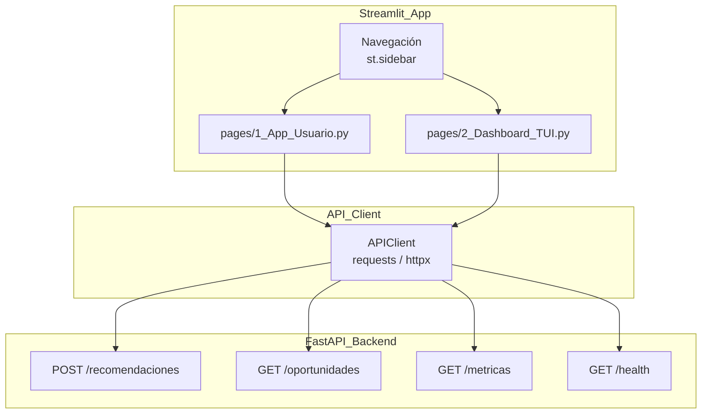

### Estructura de la Aplicación Streamlit

La aplicación sigue la convención de páginas múltiples de Streamlit (`pages/` directory):

```
app/
├── Home.py                    # Página de inicio / landing
├── pages/
│   ├── 1_App_Usuario.py       # Interfaz del viajero final (RF-12)
│   └── 2_Dashboard_TUI.py     # Dashboard analítico interno (RF-13)
├── components/
│   ├── perfil_form.py         # Formulario de perfil reutilizable
│   ├── ranking_card.py        # Tarjeta de paquete recomendado
│   ├── explicabilidad_panel.py # Panel de factores de explicabilidad
│   ├── metricas_redistribucion.py # Widgets de métricas Gini/CR5
│   └── health_status.py       # Indicadores de estado del sistema
├── api/
│   └── client.py              # APIClient — wrapper sobre endpoints FastAPI
└── config.py                  # Configuración de URLs y parámetros
```

**Navegación:** La barra lateral (`st.sidebar`) muestra el selector de idioma (es/de/en) y el enlace a ambas páginas. El estado del idioma se persiste en `st.session_state["idioma"]`.


### Sección App_Usuario (RF-12)

#### Descripción General

Interfaz de recomendación para el viajero. El flujo es: (1) el usuario rellena el formulario de perfil, (2) pulsa "Obtener recomendaciones", (3) la app llama a `POST /recomendaciones` para los tres escenarios, y (4) muestra los resultados en tres columnas paralelas.

#### Formulario de Perfil del Viajero

```python
def render_perfil_form() -> PerfilViajeroRequest | None:
    """
    Renderiza el formulario de captura del Perfil_Viajero.
    Retorna el perfil validado o None si los sliders no suman 1.0.

    Campos del formulario:
    - Preferencias temáticas (6 sliders, paso 0.05, rango [0.0, 1.0])
      Restricción visualizada: indicador de suma actual con color rojo/verde
    - Presupuesto mínimo y máximo (st.slider rango, EUR, [100, 10000])
    - Duración mínima y máxima (st.slider rango, días, [1, 30])
    - Temporada preferida (st.selectbox: Alta / Media / Baja / Indiferente)
    - Requiere accesibilidad (st.checkbox)
    - Interés en sostenibilidad (st.slider, [0.0, 1.0], paso 0.1)
    """
    with st.form("perfil_viajero"):
        st.subheader("Mis preferencias de viaje")

        col1, col2 = st.columns(2)
        with col1:
            pref_cultura     = st.slider("🏛️ Cultura",      0.0, 1.0, 0.20, step=0.05)
            pref_gastronomia = st.slider("🍽️ Gastronomía",  0.0, 1.0, 0.15, step=0.05)
            pref_naturaleza  = st.slider("🌿 Naturaleza",   0.0, 1.0, 0.20, step=0.05)
        with col2:
            pref_playa       = st.slider("🏖️ Playa",        0.0, 1.0, 0.20, step=0.05)
            pref_bienestar   = st.slider("🧘 Bienestar",    0.0, 1.0, 0.10, step=0.05)
            pref_aventura    = st.slider("🧗 Aventura",     0.0, 1.0, 0.15, step=0.05)

        suma = pref_cultura + pref_gastronomia + pref_naturaleza + pref_playa + pref_bienestar + pref_aventura
        if abs(suma - 1.0) > 0.01:
            st.error(f"La suma de preferencias es {suma:.2f}. Debe ser 1.0 (±0.01).")

        presupuesto = st.slider("Presupuesto (EUR)", 100, 10_000, (500, 3_000))
        duracion    = st.slider("Duración (días)",   1,   30,     (5, 14))
        temporada   = st.selectbox("Temporada preferida", ["Indiferente", "Alta", "Media", "Baja"])
        accesibilidad       = st.checkbox("Requiero accesibilidad especial")
        interes_sostenibilidad = st.slider("Interés en sostenibilidad", 0.0, 1.0, 0.5, step=0.1)

        submitted = st.form_submit_button("🔍 Obtener recomendaciones")
        if submitted and abs(suma - 1.0) <= 0.01:
            return PerfilViajeroRequest(
                pref_cultura=pref_cultura,
                pref_gastronomia=pref_gastronomia,
                pref_naturaleza=pref_naturaleza,
                pref_playa=pref_playa,
                pref_bienestar=pref_bienestar,
                pref_aventura=pref_aventura,
                presupuesto_min_eur=float(presupuesto[0]),
                presupuesto_max_eur=float(presupuesto[1]),
                duracion_min_dias=duracion[0],
                duracion_max_dias=duracion[1],
                temporada_preferida=None if temporada == "Indiferente" else temporada,
                requiere_accesibilidad=accesibilidad,
                interes_sostenibilidad=interes_sostenibilidad,
            )
    return None
```


#### Visualización de Resultados — Comparativa de Escenarios en Paralelo

```python
def render_comparativa_escenarios(
    resultados: dict[str, list[PaqueteRecomendado]],
    idioma: str = "es"
) -> None:
    """
    Muestra los tres rankings en columnas side-by-side (RF-12.3).
    resultados = {
        "tradicional": [...top 3 PaqueteRecomendado...],
        "moderado":    [...top 3 PaqueteRecomendado...],
        "intensivo":   [...top 3 PaqueteRecomendado...],
    }
    """
    ETIQUETAS = {
        "tradicional": {"es": "🎯 Tradicional",   "de": "🎯 Traditionell",  "en": "🎯 Traditional"},
        "moderado":    {"es": "⚖️ Moderado",       "de": "⚖️ Moderat",       "en": "⚖️ Moderate"},
        "intensivo":   {"es": "🌱 Intensivo",      "de": "🌱 Intensiv",      "en": "🌱 Intensive"},
    }

    col_trad, col_mod, col_int = st.columns(3)
    for col, escenario in zip([col_trad, col_mod, col_int], ["tradicional", "moderado", "intensivo"]):
        with col:
            st.markdown(f"### {ETIQUETAS[escenario][idioma]}")
            for pos, paquete in enumerate(resultados[escenario][:3], start=1):
                render_ranking_card(paquete, posicion=pos, idioma=idioma)
```

#### Tarjeta de Paquete Recomendado

```python
def render_ranking_card(paquete: PaqueteRecomendado, posicion: int, idioma: str) -> None:
    """
    Renderiza la tarjeta de un paquete recomendado con:
    - Posición, nombre y destino
    - Precio (EUR), duración (días), categoría
    - score_final con barra de progreso visual
    - descripcion_llm (texto generado por LLM o plantilla)
    - Expander de explicabilidad con indicadores de afinidad, TDRS, saturación
      y motivo de cambio de posición entre escenarios (RF-12.4)
    """
    with st.container(border=True):
        st.markdown(f"**#{posicion} — {paquete.nombre_paquete}**")
        st.caption(f"📍 {paquete.destino_nombre} &nbsp;|&nbsp; 💶 {paquete.precio_base_eur:.0f}€ &nbsp;|&nbsp; 🏷️ {paquete.categoria}")

        # Barra de puntuación final
        st.progress(max(0.0, min(1.0, float(paquete.score_final))),
                    text=f"Score: {paquete.score_final:.3f}")

        # Descripción en lenguaje natural
        if paquete.descripcion_llm:
            st.write(paquete.descripcion_llm)

        # Panel de explicabilidad colapsado
        with st.expander("🔍 Ver explicabilidad"):
            render_explicabilidad_panel(paquete.explicacion, idioma=idioma)
```

#### Panel de Explicabilidad

```python
def render_explicabilidad_panel(exp: ExplicacionFactores, idioma: str) -> None:
    """
    Muestra los indicadores de explicabilidad de un paquete (RF-9, RF-12.4):
    - Afinidad: barra de progreso [0,1]
    - TDRS: barra de progreso normalizada [-1,1] → [0,1]
    - Saturación: barra de progreso [0,1] con color rojo si > 0.7
    - Motivo de cambio de posición entre escenarios (si existe)
    """
    col_a, col_b, col_c = st.columns(3)
    with col_a:
        st.metric("Afinidad", f"{exp.afinidad:.3f}")
        st.progress(exp.afinidad)
    with col_b:
        tdrs_norm = (exp.tdrs + 1.0) / 2.0   # normalizar [-1,1] → [0,1]
        st.metric("TDRS", f"{exp.tdrs:.3f}")
        st.progress(tdrs_norm)
    with col_c:
        color = "🔴" if exp.saturacion > 0.7 else "🟢"
        st.metric("Saturación", f"{color} {exp.saturacion:.3f}")
        st.progress(exp.saturacion)

    if exp.motivo_cambio_posicion:
        st.info(f"↕️ {exp.motivo_cambio_posicion}")
    if exp.posicion_ranking_tradicional and exp.posicion_ranking_redistributivo:
        delta = exp.posicion_ranking_tradicional - exp.posicion_ranking_redistributivo
        if delta != 0:
            signo = "▲" if delta > 0 else "▼"
            st.caption(f"Posición en escenario tradicional: #{exp.posicion_ranking_tradicional} {signo} → redistributivo: #{exp.posicion_ranking_redistributivo}")
```


### Sección Dashboard_TUI (RF-13)

#### Descripción General

Panel analítico interno para operadores de TUI. Muestra métricas de redistribución, mapa de calor de saturación, tabla de oportunidades de mercado, diversidad del catálogo y estado del sistema. Los datos se obtienen de los endpoints `/metricas`, `/oportunidades` y `/health`.

#### Métricas de Redistribución (RF-13.3)

```python
def render_metricas_redistribucion(metricas: MetricasModelo) -> None:
    """
    Muestra Gini_Turístico y CR5 para los tres escenarios en formato comparativo.
    Una reducción del Gini entre escenario tradicional e intensivo indica redistribución efectiva.
    """
    st.subheader("📊 Métricas de Redistribución Territorial")

    col1, col2, col3 = st.columns(3)
    escenarios_data = [
        ("Tradicional", metricas.gini_tradicional, metricas.cr5_tradicional),
        ("Moderado",    metricas.gini_moderado,    metricas.cr5_moderado),
        ("Intensivo",   metricas.gini_intensivo,   metricas.cr5_intensivo),
    ]
    for col, (nombre, gini, cr5) in zip([col1, col2, col3], escenarios_data):
        with col:
            st.metric(f"Gini — {nombre}", f"{gini:.4f}",
                      delta=f"{gini - metricas.gini_tradicional:+.4f}" if nombre != "Tradicional" else None,
                      delta_color="inverse")
            st.metric(f"CR5 — {nombre}", f"{cr5:.4f}",
                      delta=f"{cr5 - metricas.cr5_tradicional:+.4f}" if nombre != "Tradicional" else None,
                      delta_color="inverse")

    # Alerta si redistribución moderada no mejora respecto al tradicional (RF-11.4)
    if metricas.gini_moderado >= metricas.gini_tradicional:
        st.warning("⚠️ El escenario moderado no está logrando reducir el Gini respecto al tradicional. Revisar parámetros de redistribución.")
```

#### Mapa de Calor de Saturación por Destino

```python
def render_mapa_saturacion(destinos: list[DestinoStats]) -> None:
    """
    Visualiza el nivel de saturación de cada destino en un mapa de calor.
    Usa st.map para posicionamiento geográfico básico (latitud/longitud del destino)
    y Altair/Plotly para el color por nivel de saturación [0,1].
    """
    import pandas as pd
    import altair as alt

    df = pd.DataFrame([
        {
            "destino": d.nombre,
            "lat": d.latitud,
            "lon": d.longitud,
            "saturacion": d.nivel_ocupacion,
            "zona": d.zona_geografica,
        }
        for d in destinos
    ])

    chart = alt.Chart(df).mark_circle(size=80).encode(
        longitude="lon:Q",
        latitude="lat:Q",
        color=alt.Color(
            "saturacion:Q",
            scale=alt.Scale(scheme="redyellowgreen", reverse=True, domain=[0, 1]),
            legend=alt.Legend(title="Saturación")
        ),
        tooltip=["destino:N", "saturacion:Q", "zona:N"],
        size=alt.Size("saturacion:Q", scale=alt.Scale(range=[50, 300])),
    ).project("mercator").properties(
        title="Mapa de saturación de destinos",
        width=700, height=400
    )
    st.altair_chart(chart, use_container_width=True)
```

#### Tabla de Oportunidades de Mercado (RF-13.4)

```python
def render_tabla_oportunidades(oportunidades: list[OportunidadMercado]) -> None:
    """
    Muestra destinos con indicador_oportunidad > umbral configurado (RF-10.2).
    Permite filtrar por zona geográfica y temporada (RF-13.4).
    Incluye columnas: destino, zona, temporada, afinidad_media, nivel_ocupacion,
    indicador_oportunidad, perfil_usuario_afin.
    """
    import pandas as pd

    col_filtro1, col_filtro2 = st.columns(2)
    with col_filtro1:
        zona_filtro = st.selectbox("Zona geográfica", ["Todas", "Mediterráneo", "Caribe"])
    with col_filtro2:
        temp_filtro = st.selectbox("Temporada", ["Todas", "Alta", "Media", "Baja"])

    df = pd.DataFrame([o.model_dump() for o in oportunidades])
    if zona_filtro != "Todas":
        df = df[df["zona_geografica"] == zona_filtro]
    if temp_filtro != "Todas":
        df = df[df["temporada"] == temp_filtro]

    df = df.sort_values("indicador_oportunidad", ascending=False)
    st.dataframe(
        df[["destino_nombre", "zona_geografica", "temporada",
            "afinidad_media", "nivel_ocupacion", "indicador_oportunidad",
            "perfil_usuario_afin"]],
        use_container_width=True,
        column_config={
            "indicador_oportunidad": st.column_config.ProgressColumn(
                "Oportunidad", min_value=0, max_value=1, format="%.3f"
            ),
            "nivel_ocupacion": st.column_config.ProgressColumn(
                "Ocupación", min_value=0, max_value=1, format="%.2f"
            ),
        }
    )
```


#### Comparativa de Catálogo — Diversidad por Categoría y Región

```python
def render_diversidad_catalogo(metricas: MetricasModelo) -> None:
    """
    Muestra métricas de diversidad del catálogo (RF-13.2):
    - Intra-list diversity media por escenario
    - Cobertura del catálogo (% de paquetes recomendados al menos una vez)
    - Novedad media
    Incluye gráfico de barras comparativo por categoría y región.
    """
    import altair as alt
    import pandas as pd

    st.subheader("🗂️ Diversidad del Catálogo")

    col1, col2, col3 = st.columns(3)
    col1.metric("Diversidad intra-lista (moderado)", f"{metricas.intra_list_diversity:.4f}")
    col2.metric("Cobertura del catálogo", f"{metricas.cobertura_catalogo:.1%}")
    col3.metric("Novedad media", f"{metricas.novedad_media:.4f}")

    # Distribución de recomendaciones por categoría
    if metricas.distribucion_categoria:
        df_cat = pd.DataFrame(
            list(metricas.distribucion_categoria.items()),
            columns=["categoria", "porcentaje"]
        )
        chart_cat = alt.Chart(df_cat).mark_bar().encode(
            x=alt.X("porcentaje:Q", title="% Recomendaciones"),
            y=alt.Y("categoria:N", sort="-x", title="Categoría"),
            color=alt.Color("porcentaje:Q", scale=alt.Scale(scheme="blues")),
            tooltip=["categoria:N", alt.Tooltip("porcentaje:Q", format=".1%")]
        ).properties(title="Distribución por categoría", height=200)
        st.altair_chart(chart_cat, use_container_width=True)
```

#### Estado del Sistema — Módulos Activos (RF-NF-4.4)

```python
def render_health_status(health: HealthStatus) -> None:
    """
    Muestra el estado operativo de cada módulo del sistema (RF-NF-4.4).
    Módulos monitorizados: Scraper, Repositorio, Modelo_Afinidad, LLM_Adapter.
    Colores: verde (ok), amarillo (degradado), rojo (no disponible).
    """
    st.subheader("🟢 Estado del Sistema")

    ICONOS = {"ok": "🟢", "degraded": "🟡", "unavailable": "🔴"}
    modulos = [
        ("Scraper",          health.scraper),
        ("Repositorio",      health.repositorio),
        ("Modelo_Afinidad",  health.modelo_afinidad),
        ("LLM_Adapter",      health.llm_adapter),
    ]
    cols = st.columns(len(modulos))
    for col, (nombre, estado) in zip(cols, modulos):
        icono = ICONOS.get(estado.status, "⚪")
        col.metric(nombre, f"{icono} {estado.status.upper()}")
        if estado.latency_ms is not None:
            col.caption(f"Latencia: {estado.latency_ms:.0f}ms")
```

#### Exportación CSV (RF-13.6)

```python
def render_export_button(metricas: MetricasModelo) -> None:
    """
    Botón de exportación de todas las métricas en formato CSV (RF-13.6).
    Un único clic genera y descarga el fichero.
    """
    import pandas as pd
    import io

    def metricas_to_csv(m: MetricasModelo) -> str:
        rows = {
            "precision_at_5": m.precision_at_5,
            "precision_at_10": m.precision_at_10,
            "recall_at_5": m.recall_at_5,
            "recall_at_10": m.recall_at_10,
            "ndcg_at_5": m.ndcg_at_5,
            "ndcg_at_10": m.ndcg_at_10,
            "map_at_5": m.map_at_5,
            "map_at_10": m.map_at_10,
            "gini_tradicional": m.gini_tradicional,
            "gini_moderado": m.gini_moderado,
            "gini_intensivo": m.gini_intensivo,
            "cr5_tradicional": m.cr5_tradicional,
            "cr5_moderado": m.cr5_moderado,
            "cr5_intensivo": m.cr5_intensivo,
            "intra_list_diversity": m.intra_list_diversity,
            "cobertura_catalogo": m.cobertura_catalogo,
            "novedad_media": m.novedad_media,
        }
        return pd.DataFrame([rows]).to_csv(index=False)

    csv_data = metricas_to_csv(metricas)
    st.download_button(
        label="⬇️ Exportar métricas CSV",
        data=csv_data,
        file_name="metricas_tui.csv",
        mime="text/csv",
    )
```


### APIClient — Comunicación con el Backend FastAPI

```python
class APIClient:
    """
    Wrapper sobre los endpoints FastAPI del Bloque 3.
    Gestiona errores de conexión y devuelve objetos Pydantic tipados.
    Base URL configurable en config.py (variable de entorno API_BASE_URL).
    """
    base_url: str  # ej: "http://localhost:8000"
    timeout: float = 10.0

    def get_recomendaciones(
        self, perfil: PerfilViajeroRequest, escenario: str = "moderado", top_k: int = 3
    ) -> list[PaqueteRecomendado]:
        """
        POST /recomendaciones
        Lanza APIConnectionError si el backend no responde (RF-12.6).
        """
        response = requests.post(
            f"{self.base_url}/recomendaciones",
            json={"perfil": perfil.model_dump(), "escenario": escenario, "top_k": top_k},
            timeout=self.timeout,
        )
        response.raise_for_status()
        return [PaqueteRecomendado(**p) for p in response.json()]

    def get_recomendaciones_todos_escenarios(
        self, perfil: PerfilViajeroRequest, top_k: int = 3
    ) -> dict[str, list[PaqueteRecomendado]]:
        """
        Llama a /recomendaciones tres veces (una por escenario) en paralelo.
        Usa concurrent.futures.ThreadPoolExecutor para mantener latencia < 3s (RF-12.5).
        """
        from concurrent.futures import ThreadPoolExecutor
        escenarios = ["tradicional", "moderado", "intensivo"]
        with ThreadPoolExecutor(max_workers=3) as executor:
            futures = {
                esc: executor.submit(self.get_recomendaciones, perfil, esc, top_k)
                for esc in escenarios
            }
        return {esc: fut.result() for esc, fut in futures.items()}

    def get_oportunidades(
        self, zona: str | None = None, temporada: str | None = None, umbral: float = 0.20
    ) -> list[OportunidadMercado]:
        """GET /oportunidades"""

    def get_metricas(self) -> MetricasModelo:
        """GET /metricas"""

    def get_health(self) -> HealthStatus:
        """GET /health"""
```

**Manejo de errores de conexión (RF-12.6):**

```python
def safe_api_call(func, *args, **kwargs):
    """
    Envuelve llamadas a la API con manejo de error user-friendly.
    Si el backend no responde, muestra st.error con mensaje comprensible
    y registra el fallo en el log de la aplicación.
    """
    try:
        return func(*args, **kwargs)
    except (requests.ConnectionError, requests.Timeout) as e:
        st.error("⚠️ No se puede conectar con el servidor de recomendaciones. "
                 "Por favor, verifica que el backend esté en funcionamiento.")
        logger.error(f"API connection error: {e}", exc_info=True)
        return None
    except requests.HTTPError as e:
        st.error(f"⚠️ Error del servidor ({e.response.status_code}). "
                 "Inténtalo de nuevo en unos momentos.")
        logger.error(f"API HTTP error: {e}", exc_info=True)
        return None
```


### Gestión de Estado de la Sesión

El estado de la sesión en Streamlit se gestiona mediante `st.session_state`. La siguiente tabla define las claves utilizadas y su ciclo de vida:

| Clave en `st.session_state` | Tipo | Descripción | Inicialización |
|-----------------------------|------|-------------|----------------|
| `idioma` | `str` | Idioma seleccionado: `"es"` / `"de"` / `"en"` | `"es"` (sidebar) |
| `perfil_actual` | `PerfilViajeroRequest \| None` | Perfil del viajero introducido en el formulario | `None` |
| `resultados_escenarios` | `dict[str, list[PaqueteRecomendado]] \| None` | Resultados de los tres escenarios para el perfil actual | `None` |
| `paquete_seleccionado` | `PaqueteRecomendado \| None` | Paquete sobre el que el usuario solicitó explicabilidad | `None` |
| `metricas_cache` | `MetricasModelo \| None` | Métricas cacheadas (se actualizan cada 60s en el Dashboard) | `None` |
| `oportunidades_cache` | `list[OportunidadMercado] \| None` | Oportunidades cacheadas | `None` |
| `health_cache` | `HealthStatus \| None` | Estado del sistema cacheado (se actualiza cada 30s) | `None` |
| `last_fetch_metricas` | `float` | Timestamp de la última actualización de métricas (Unix) | `0.0` |

**Reglas de gestión de estado:**
- El `perfil_actual` persiste entre cambios de escenario para no obligar al usuario a reintroducir sus datos (RF-12.3).
- Si `resultados_escenarios` está en sesión y el `perfil_actual` no ha cambiado, la app no vuelve a llamar a la API al cambiar de pestaña.
- El Dashboard refresca `metricas_cache` cada 60 segundos usando `st.empty()` y un bucle con `time.sleep(60)` en un thread auxiliar, garantizando actualización en < 10s tras cambios en el repositorio (RF-13.5).

```python
def inicializar_session_state() -> None:
    """Inicializa todas las claves de session_state con valores por defecto."""
    defaults = {
        "idioma": "es",
        "perfil_actual": None,
        "resultados_escenarios": None,
        "paquete_seleccionado": None,
        "metricas_cache": None,
        "oportunidades_cache": None,
        "health_cache": None,
        "last_fetch_metricas": 0.0,
    }
    for key, value in defaults.items():
        if key not in st.session_state:
            st.session_state[key] = value
```


### Flujo de Datos del Bloque 6

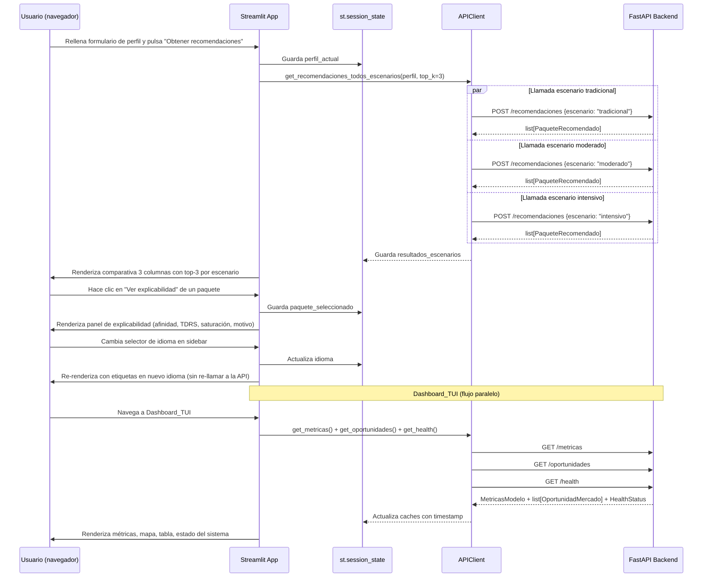


### Selector de Idioma

```python
def render_selector_idioma() -> str:
    """
    Muestra el selector de idioma en la barra lateral.
    Actualiza st.session_state["idioma"] cuando el usuario cambia la selección.
    Retorna el código de idioma activo: "es", "de" o "en".
    """
    opciones = {"🇪🇸 Español": "es", "🇩🇪 Deutsch": "de", "🇬🇧 English": "en"}
    seleccion = st.sidebar.selectbox(
        "Idioma / Language / Sprache",
        list(opciones.keys()),
        index=list(opciones.values()).index(st.session_state.get("idioma", "es"))
    )
    idioma = opciones[seleccion]
    st.session_state["idioma"] = idioma
    return idioma
```

**Alcance del selector de idioma:** Controla el idioma de las etiquetas de la interfaz Streamlit (títulos, botones, mensajes de error). La `descripcion_llm` de cada paquete ya viene en el idioma correcto desde el Bloque 5 (detectado del perfil del usuario), por lo que no se re-solicita al cambiar idioma en la UI.

### Configuración y Despliegue

#### Variables de Entorno

```bash
# Backend FastAPI
API_BASE_URL=http://localhost:8000   # URL del backend FastAPI (Bloque 3)

# OpenAI (consumido por el backend, no directamente por Streamlit)
OPENAI_API_KEY=sk-...               # Clave de API de OpenAI

# Base de datos (consumido por el backend)
DATABASE_URL=sqlite:///./tui_recsys.db

# Streamlit
STREAMLIT_SERVER_PORT=8501
STREAMLIT_SERVER_ADDRESS=0.0.0.0
```

#### Arranque de la Aplicación

Para ejecutar la aplicación localmente, se deben iniciar dos procesos independientes:

```bash
# 1. Arrancar el backend FastAPI (Bloque 3)
uvicorn src.api.main:app --host 0.0.0.0 --port 8000 --reload

# 2. Arrancar la app Streamlit (Bloque 6) — en otro terminal
streamlit run app/Home.py --server.port 8501
```

#### Fichero de Configuración de la App

```python
# app/config.py
import os

API_BASE_URL: str = os.getenv("API_BASE_URL", "http://localhost:8000")
API_TIMEOUT: float = float(os.getenv("API_TIMEOUT", "10.0"))
CACHE_TTL_METRICAS: int = int(os.getenv("CACHE_TTL_METRICAS", "60"))   # segundos
CACHE_TTL_HEALTH: int   = int(os.getenv("CACHE_TTL_HEALTH", "30"))     # segundos
DEFAULT_IDIOMA: str = os.getenv("DEFAULT_IDIOMA", "es")
TOP_K_RECOMENDACIONES: int = int(os.getenv("TOP_K_RECOMENDACIONES", "3"))
```

#### Dependencias Python del Bloque 6

```
# requirements-app.txt (añadir a requirements.txt principal)
streamlit>=1.35.0
requests>=2.31.0
httpx>=0.27.0
altair>=5.3.0
pandas>=2.2.0
plotly>=5.22.0
pydantic>=2.7.0
```


### Propiedades de Corrección (PBT relevantes del Bloque 6)

*Una propiedad es una característica o comportamiento que debe cumplirse en todas las ejecuciones válidas del sistema — esencialmente, una afirmación formal sobre lo que el sistema debe hacer.*

#### B6-1: Suma de preferencias validada antes de llamar a la API

*Para cualquier* conjunto de valores de los 6 sliders de preferencias temáticas cuya suma difiera de 1.0 en más de 0.01, la función `render_perfil_form()` **NO** debe llamar a la API ni retornar un `PerfilViajeroRequest`. Debe mostrar un mensaje de error y retornar `None`.

**Valida: Requisito 6** (formulario de perfil del viajero — validación de entrada)

#### B6-2: Tres escenarios siempre presentes en la comparativa

*Para cualquier* respuesta válida de la API, `render_comparativa_escenarios()` debe renderizar exactamente 3 columnas con las etiquetas `"tradicional"`, `"moderado"` e `"intensivo"`, independientemente del número de paquetes en cada lista.

**Valida: Requisito 6** (comparativa de escenarios de recomendación)

#### B6-3: Fallback de conexión nunca lanza excepción al usuario

*Para cualquier* llamada a `safe_api_call()` que resulte en `ConnectionError`, `Timeout` o `HTTPError`, la función debe mostrar un mensaje de error en la UI y retornar `None`. **NUNCA** debe propagar la excepción hasta Streamlit (lo que causaría una página de error en blanco).

**Valida: Requisito 6** (manejo robusto de errores de comunicación con el backend)

#### B6-4: Session state siempre inicializado

*Para cualquier* flujo de navegación en la app (carga inicial, cambio de página, recarga), todas las claves definidas en `inicializar_session_state()` deben existir en `st.session_state` antes de que cualquier componente intente leerlas.

**Valida: Requisito 6** (estabilidad del estado de sesión entre páginas)

#### B6-5: Perfil persistido entre escenarios

*Para cualquier* usuario que haya obtenido recomendaciones y cambie entre columnas de escenarios, el `perfil_actual` en `st.session_state` debe ser el mismo objeto sin requerir reintroducción de datos.

**Valida: Requisito 6** (persistencia del perfil durante la sesión de uso)

---

## Estructura de Carpetas del Proyecto

```
tui-recommendation-model/
├── app/                              # Bloque 6 — Interfaz Streamlit
│   ├── Home.py
│   ├── pages/
│   │   ├── 1_App_Usuario.py
│   │   └── 2_Dashboard_TUI.py
│   ├── components/
│   │   ├── perfil_form.py
│   │   ├── ranking_card.py
│   │   ├── explicabilidad_panel.py
│   │   ├── metricas_redistribucion.py
│   │   └── health_status.py
│   ├── api/
│   │   └── client.py
│   └── config.py
├── src/
│   ├── scraping/                     # Bloque 1 — Scraping y Limpieza
│   │   ├── __init__.py
│   │   ├── orchestrator.py           # ScraperOrchestrator
│   │   ├── tui_spider.py             # TUISpider (ES/DE/UK)
│   │   ├── reddit_collector.py       # RedditCollector (PRAW)
│   │   ├── tripadvisor_scraper.py    # TripAdvisorScraper
│   │   ├── booking_scraper.py        # BookingOccupancyScraper
│   │   ├── statistics_client.py      # Eurostat / INE / UNWTO
│   │   └── cleaner.py                # DataCleaner
│   ├── embeddings/                   # Bloque 2 — Embeddings y NLP
│   │   ├── __init__.py
│   │   ├── text_embedder.py          # TextEmbedder (MiniLM / e5-large)
│   │   ├── review_aggregator.py      # ReviewAggregator
│   │   ├── semantic_fuser.py         # SemanticFuser
│   │   └── hybrid_vector_builder.py  # HybridVectorBuilder
│   ├── data/                         # Bloque 3 — Data Engineering
│   │   ├── __init__.py
│   │   ├── models.py                 # Modelos SQLAlchemy (tablas)
│   │   ├── repository.py             # Repositorio (CRUD)
│   │   ├── vector_store.py           # Chroma / pgvector wrapper
│   │   ├── synthetic_users.py        # SyntheticUserGenerator
│   │   └── retry_policy.py           # RetryPolicy
│   ├── api/                          # Bloque 3 — FastAPI
│   │   ├── __init__.py
│   │   ├── main.py                   # FastAPI app, routers
│   │   ├── schemas.py                # Modelos Pydantic (request/response)
│   │   └── dependencies.py           # Inyección de dependencias
│   ├── recommender/                  # Bloque 4 — Modelo Recomendador
│   │   ├── __init__.py
│   │   ├── affinity/
│   │   │   ├── cosine_model.py       # CosineAffinityModel (baseline)
│   │   │   └── lightfm_model.py      # LightFMAffinityModel (avanzado)
│   │   ├── tdrs_calculator.py        # TDRSCalculator
│   │   ├── reranking_engine.py       # ReRankingEngine (3 escenarios)
│   │   ├── explainability.py         # ExplainabilityBuilder
│   │   ├── opportunity_detector.py   # MarketOpportunityDetector
│   │   └── territorial_simulator.py  # TerritorialImpactSimulator
│   └── llm/                          # Bloque 5 — Integración LLM
│       ├── __init__.py
│       ├── llm_adapter.py            # LLMAdapter (OpenAI GPT-4o-mini)
│       ├── prompt_builder.py         # PromptBuilder
│       ├── fallback_templates.py     # FallbackTemplateEngine
│       ├── response_validator.py     # LLMResponseValidator
│       ├── token_counter.py          # TokenCounter (tiktoken)
│       └── usage_logger.py           # UsageLogger
├── tests/
│   ├── unit/
│   │   ├── test_cleaner.py
│   │   ├── test_embeddings.py
│   │   ├── test_tdrs.py
│   │   ├── test_reranking.py
│   │   ├── test_llm_adapter.py
│   │   └── test_fallback_templates.py
│   ├── pbt/                          # Property-Based Tests (Hypothesis)
│   │   ├── test_pbt_afinidad.py      # PBT-1, PBT-2, PBT-3
│   │   ├── test_pbt_embeddings.py    # PBT-5
│   │   ├── test_pbt_llm.py           # B5-1..B5-6
│   │   ├── test_pbt_ui.py            # B6-1..B6-5
│   │   └── test_pbt_data.py          # PBT-7
│   └── integration/
│       ├── test_api_endpoints.py
│       └── test_pipeline_e2e.py
├── scripts/
│   ├── run_scraping.py               # Ejecutar ciclo de scraping
│   ├── generate_embeddings.py        # Generar embeddings del catálogo
│   ├── train_model.py                # Entrenar LightFM / baseline
│   ├── generate_synthetic_users.py   # Generar 500 usuarios sintéticos
│   └── run_simulation.py             # Simulación impacto territorial
├── data/
│   ├── raw/                          # Datos crudos de scrapers
│   ├── processed/                    # Datos limpios y normalizados
│   └── embeddings/                   # Vectores serializados (.npy)
├── config.yml                        # Configuración central del sistema
├── .env.example                      # Plantilla de variables de entorno
├── requirements.txt                  # Dependencias backend
├── requirements-app.txt              # Dependencias Streamlit
└── README.md
```
